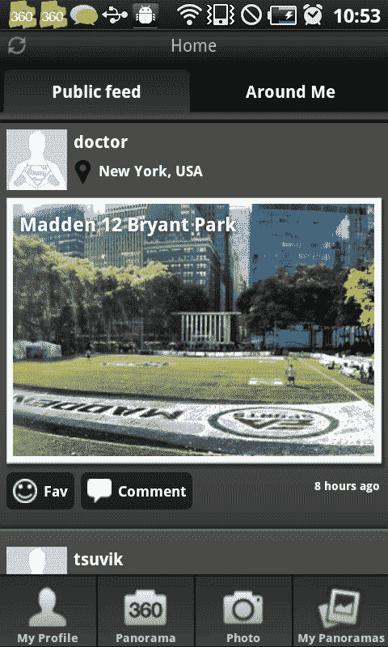

# 360: TeliportMe 将其黑仔全景应用程序引入安卓系统(哦，它可以在 200 多部手机上运行)

> 原文：<https://web.archive.org/web/https://techcrunch.com/2011/07/29/360-teliportme-brings-its-killer-panorama-app-to-android-oh-and-it-works-on-over-200-phones/>

去年 11 月，TechCrunch 的莎拉·莱西[采访了来自“社交街景”初创公司](https://web.archive.org/web/20230205014804/https://techcrunch.com/2010/11/15/witn-phototours-vineet-devaiah-featuring-the-voice-of-mike-arrington/) [Phototour.in](https://web.archive.org/web/20230205014804/http://www.phototour.in/) 的维尼特·迪瓦亚，当时，这家公司刚刚收到一些知名美国投资者的投资意向书，最近还被[英伟达](https://web.archive.org/web/20230205014804/http://www.crunchbase.com/company/nvidia)授予“2010 年最佳新兴科技公司”。据 Devaiah 称，这家初创公司是第一家获得该奖项的国际、非资助、20 岁以下的公司。

从那时起，Phototour 增加了奥斯卡奖证书获得者和企业家[巴拉·s·马年](https://web.archive.org/web/20230205014804/http://en.wikipedia.org/wiki/Bala_S._Manian)作为顾问(他因对电影中使用的光学技术的贡献而获得“技术成就奖”，包括《星球大战》。)并在 Android 上为其图像和全景众包应用[“360”](https://web.archive.org/web/20230205014804/https://market.android.com/details?id=com.vtcreator.android360)的 alpha 版本赢得了超过 47，000 名用户。在相对较短的时间内，用户已经记录了超过 75，000 张全景图，因此，考虑到有传言称[iPhone 5 将有一个原生全景图](https://web.archive.org/web/20230205014804/http://9to5mac.com/2011/06/08/apple-plans-native-panorama-camera-functionality-in-ios-5/)应用程序，消息人士告诉我们，360 可能是与 Android 潜在合作伙伴的候选人，以便它可以与苹果并驾齐驱。

此外，这家初创公司今天正式宣布，它将更名为 TeliportMe，并将 360 从 alpha 中拿出来，以成衣的形式进入公共领域。免费的。诚然，智能手机的 360 度全景应用并不新鲜。市场上有很多很酷的应用和小工具拥有这些功能，比如[“你得看看这个！”](https://web.archive.org/web/20230205014804/https://techcrunch.com/2010/07/23/you-gotta-see-this-panorama-app-for-iphone-looks-jankily-delicious/)，Occipital 的[360°全景](https://web.archive.org/web/20230205014804/http://itunes.apple.com/us/app/360-panorama/id377342622?mt=8)，还有[微软的 Photosynth](https://web.archive.org/web/20230205014804/http://itunes.apple.com/us/app/photosynth/id430065256?mt=8) ，不一而足。

 鉴于这一竞争，TeliportMe 希望通过构建一个适用于所有原始设备制造商的高质量 Android 应用程序，使自己在该领域脱颖而出。根据 Devaiah 的说法，全景应用程序往往非常以硬件为中心，因为它们依赖于智能手机的摄像头、加速度计、陀螺仪、RAM 等。由于 Android 依赖于如此多不同的原始设备制造商，为 Android 构建一个良好的 360 度应用程序成为一个棘手的命题，也是大多数 panorama 应用程序基于 iOS 构建的原因(得益于其与硬件的垂直集成)。

Android 的另一个障碍是，只有大约 20%的智能手机具有 iPhone 的处理能力，由于全景应用程序在照片拼接过程中需要大量的图像处理，许多 Android 手机没有足够的内存来实现这一点(至少在速度上)。Devaiah 举了一个像 HTC wild fire(T4)这样的手机的例子，它的处理能力比不上 iPhone 2G。(燃！)

这就是为初创公司赢得“最佳新兴技术”奖的技术发挥作用的地方。首席执行官表示，TeliportMe 正在将其照片拼接技术引入 android 智能手机，这在很大程度上消除了由于多种硬件配置导致的问题，使其能够在 200 多种型号的 Android 手机上顺利运行。(这家初创公司还开发了一款可以在浏览器上运行的照片剪辑应用，并将很快推出。)

因此，360 允许其用户快速拍摄高质量的全景照片，然后他们可以在应用程序的 3D 浏览器上观看。用户可以通过脸书和 Twitter 分享全景照片，也可以在 360 的公共实时订阅源上查看、评论和“喜欢”世界各地的人拍摄的照片。该应用程序还利用手机的位置，允许用户通过“我周围”选项发现附近使用 360 的其他人。

在 Android Marketplace 查看 360[这里](https://web.archive.org/web/20230205014804/https://market.android.com/details?id=com.vtcreator.android360)，对于 360 对“谷歌+家伙”不喜欢其他照片应用的幽默态度，查看[这个视频](https://web.archive.org/web/20230205014804/http://www.youtube.com/watch?v=gkzIlXVEnLw)。更多关于 360 的信息，请看下面的视频:

【YouTube = http://www . YouTube . com/watch？v=XjQCjGODOHk]