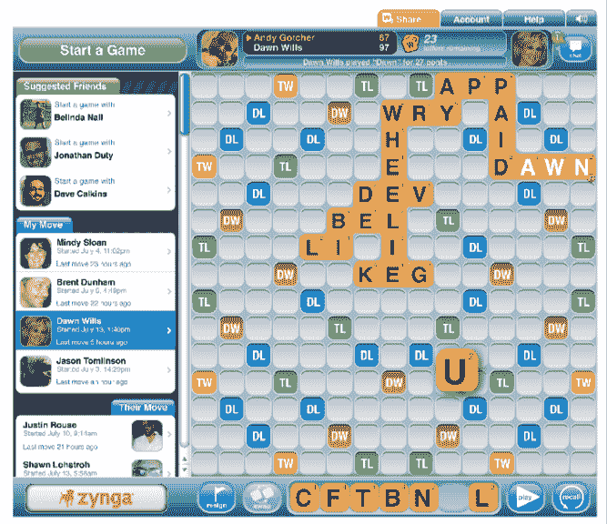

# Zynga 通过新的脸书游戏 TechCrunch 将类似拼字游戏的“朋友间的对话”带到了网络上

> 原文：<https://web.archive.org/web/https://techcrunch.com/2011/08/01/zynga-brings-scrabble-like-words-with-friends-to-the-web-with-new-facebook-game/>

# Zynga 通过新的脸书游戏将类似拼字游戏的“朋友间的对话”带到了网络上

去年 12 月，当 Zynga [收购了移动游戏工作室 Newtoy](https://web.archive.org/web/20230203211719/https://techcrunch.com/2010/12/02/zynga-buys-mobile-gaming-developer-newtoy/)时，这家社交游戏巨头接管了德州游戏工作室最受欢迎的游戏之一《老友记》。对于那些不熟悉与朋友玩[文字游戏的人来说，](https://web.archive.org/web/20230203211719/https://techcrunch.com/2010/06/10/a-look-behind-the-words-with-friends-iphone-gaming-phenomenon/)手机游戏(iOS 和 [Android](https://web.archive.org/web/20230203211719/https://techcrunch.com/2011/02/02/zynga-brings-newtoys-crossword-game-words-with-friends-to-android-phones/) )类似于与你的一个朋友玩类似拼字游戏的文字游戏。今天，Zynga 宣布即将推出一款基于网络的脸书游戏，游戏名为《今日与朋友》(据 Zynga 称，该游戏将“很快”推出，但没有具体日期)。

与朋友的话挑战玩家通过在数字游戏板上放置字母拼块来创造单词，以便得分。与拼字游戏类似，每个字母都有一个分值，玩家通过在游戏板上完成体育单词来获得积分。这是一款多人游戏，非常适合像脸书这样的社交平台。虽然 iOS 和 Android 应用程序提供了脸书连接，但这是第一个基于脸书的基于网络的游戏与朋友的话。

脸书游戏的特点包括一个吹牛馈送，允许你得分后在他们的墙上公开呼唤你的朋友。您还可以发送脸书请求，通知朋友何时轮到他们玩游戏，或者发送信息邀请朋友开始新游戏。

游戏可能需要几天甚至几周才能完成，玩家可能同时参与多达 20 个游戏。此外，iOS 和 Android 设备上的玩家将能够在他们的移动设备和脸书之间移植游戏。

Zynga 表示，这是它第一次将手机游戏带到脸书，而不是反过来。

Zynga 最近刚刚推出了另一款 Newtoy 游戏— [与朋友一起玩](https://web.archive.org/web/20230203211719/https://techcrunch.com/2011/06/06/zynga-turns-hangman-into-a-social-ios-game-with-the-debut-of-hanging-with-friends/)，这是 Zynga 对经典流行游戏 Hangman 的继承。

考虑到游戏在移动平台上的受欢迎程度，脸书版的《老友记》应该会很受欢迎。正如 [Inside Mobile Apps](https://web.archive.org/web/20230203211719/http://www.insidemobileapps.com/2011/07/01/zynga-paid-53-3-million-in-cash-and-stock-for-newtoy-ipo-filing-shows/) 最近报道的那样，收购 Newtoy 和 Words With Friends 帮助 Zynga 在移动平台上的日活跃用户数在 7 个月内增长了 10 倍。在最近提交给 SEC 的一份文件中，Zynga 透露，通过“结合两家公司在社交游戏机制方面的规模和专业知识”,收购后四个月，Zynga 能够将 Words With Friends 的日活跃用户数增加一倍。"

