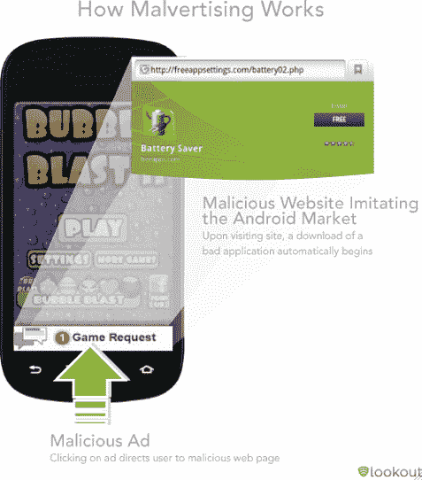
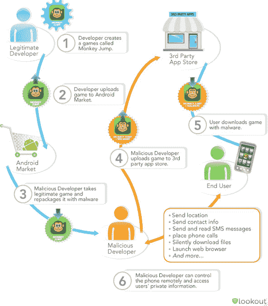
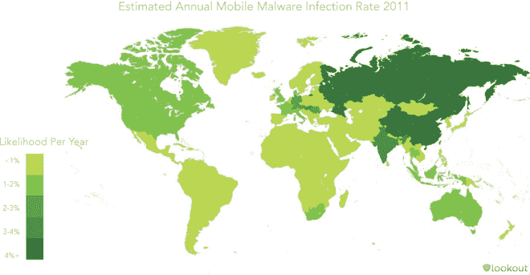

# Lookout 报告:Android 恶意软件在过去 6 个月中显著增加 TechCrunch

> 原文：<https://web.archive.org/web/http://techcrunch.com/2011/08/02/lookout-report-mobile-threat-activity-has-increased-significantly-over-past-6-months/>

# Lookout 报告:Android 恶意软件在过去 6 个月中显著增加

[Lookout，](https://web.archive.org/web/20230203043736/https://www.mylookout.com/)一家在[为许多智能手机提供安全服务的公司](https://web.archive.org/web/20230203043736/https://techcrunch.com/2010/05/18/lookout-lands-11-million-from-accel-khosla-and-others-for-smartphone-security-platform/)正在发布其移动威胁报告的结果。该报告基于 Lookout 的移动威胁网络的威胁和安全数据，其中包括从全球超过 70 万个应用程序和 1000 万台设备收集的数据。你可以在这里查看[的完整报告。](https://web.archive.org/web/20230203043736/https://www.mylookout.com/mobile-threat-report)

Lookout 的主要发现是，移动恶意软件显著增加，Android 用户今天遇到恶意软件的可能性是六个月前的两倍半。Lookout 估计，2011 年上半年，有 50 万到 100 万用户受到了手机恶意软件的影响。

2011 年上半年，在市场和下载网站上发现的带有恶意软件的独特应用程序的数量从 80 个增加到 400 个。最受欢迎的威胁之一 DroidDream 发布了 80 多个独特的应用程序来控制用户的手机。GGTracker 是一种较新的恶意软件威胁，专门通过高级短信服务针对美国 Android 用户，已将其受感染的应用数量增加到 15 个应用/

威胁不仅仅是通过应用和应用市场接收恶意软件。基于移动网络的威胁也已成为威胁格局的重要组成部分，在一年的时间里，十分之三的移动用户可能会点击不安全的链接，包括恶意链接和网络钓鱼链接。

不幸的是，Lookout 说恶意软件作者正在使用新技术来感染手机。现在一些手机广告也不安全了。作者使用名为 Malvertising 的策略，利用移动广告将用户导向恶意网站，从而触发恶意软件的自动下载。

基本上，现在比以往任何时候，智能手机用户都需要对从可信的应用商店和下载网站下载应用程序以及点击移动网络中的链接保持谨慎。Lookout 自己的安全应用可以帮助用户应对这些问题。

在 2011 年第二季度，Lookout 在其用户群中发现的移动恶意软件数量增加了 85%。由于这种趋势，Lookout 的产品一直在快速增长。去年 12 月，该公司有 400 万用户，现在这个数字已经翻了一倍多，有 1000 万用户。Lookout 目前每月新增 100 万用户。该公司刚刚从 Index Ventures、Accel Partners 和 Khosla Ventures 获得了 1950 万美元的投资。甚至运营商也开始注意到[。](https://web.archive.org/web/20230203043736/https://techcrunch.com/2011/07/20/lookout-opens-up-api-partners-with-verizon-to-analyze-mobile-security-threats-on-v-cast-app-store/)

