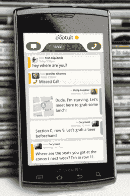

# Poptuit 希望通过使 Android 拨号器更时尚、更智能来彻底改造它

> 原文：<https://web.archive.org/web/http://techcrunch.com/2011/08/02/poptuit-looks-to-reinvent-the-android-dialer-by-making-it-sleeker-and-smarter/>

这已经是老生常谈了，但毫无疑问，2007 年 iPhone 的发布永远改变了移动设备的未来。即使是设备的实际电话部分也有了巨大的改进:可视语音邮件、相对简单的联系人管理，以及快速查看你最近的通话。而且，呃，拨号器从那以后看起来就差不多一样了。安卓的拨号器也是如此，它与 iPhone 的拨号器基本相同。

它们单调乏味，在整合不同的沟通渠道方面做得不好，而且它们远没有达到应有的聪明程度。

进入 [Poptuit](https://web.archive.org/web/20230204230910/http://www.poptuit.com/) ，这是一家新的创业公司，它希望通过将你的智能手机变成你所有社交内容的中心枢纽来重新发明你的智能手机的拨号器——而且它看起来更好启动。目前，这款仅支持 Android 的应用程序还处于私人测试阶段，但是第一批进入[这里](https://web.archive.org/web/20230204230910/http://poptuit.com/private-beta)并输入代码“Crunch”的 100 名读者将获得访问权限。

总之，Poptuit 看起来滑头。拨号器已经得到了很好的翻新，更重要的是，它实际上比你习惯的拨号器更智能。当你给你的朋友、同事和家人打电话时，Poptuit 会智能地在一个网格中显示他们的面孔，这样你最常打电话的联系人就很容易找到了。

而且，聪明的是，Poptuit 为你经常打电话的业务提供了一个单独的表格，即使这些业务没有存储在你的联系人列表中。首席执行官 Henry M. Vogel 解释说，许多用户最终会反复使用 Yelp 或 Google 查找相同的餐馆和服务，但他们不会保存它们，因为他们不想让他们的联系人变得杂乱。Poptuit 通过自动记住它们来解决这个问题，而无需将它们添加到您的地址簿中。

【YouTube = http://www . YouTube . com/watch？v=lAo_0ubboTk]

除了作为一个从你的习惯中学习的动态拨号器，Poptuit 还希望成为一个交流平台。你的每个联系人都会在 Poptuit 应用程序中获得自己自动生成的个人资料页面，该页面会查找他们的脸书个人资料照片，还会显示你最近通过短信与他们发送的任何消息(Android 允许应用程序在获得许可的情况下访问短信数据库)。

此外，如果你想节省这些短信费用，你可以鼓励你的朋友自己加入 Poptuit——如果双方都使用这项服务，他们可以通过 pop tuit 的网络免费发送消息，就像他们通过 IM 发送消息一样。我不相信人们真的想用另一种方式发送信息，但是这个应用程序可以很好地处理短信，所以如果你不想用它，你就不需要使用它。

我问了 Poptuit 关于数据安全的问题，他们说他们非常重视这个问题——毕竟，这个应用程序正在进入你的短信和联系人数据库。该公司表示，它在服务器上存储的唯一内容是 Poptuit 用户之间发送的免费信息(以及*而非*短信)。该服务还从你的地址簿上传姓名和电话号码，它说这是使用不对称加密保护的(我不喜欢他们的设置，因为虽然你上传的姓名是加密的，但电话号码不是，但大多数人可能不会在意)。

在这一点上，该公司的盈利计划有点模糊，但他们看到了大量的机会。特别是，他们认为经常致电的企业列表可能是强大的——该应用程序可能会提供你喜欢的企业或其竞争对手的报价，并且它也在考虑让商家“认领”他们自己的 Poptuit 页面。不过在这一点上，这款应用是无广告的。

Poptuit 是由 [Apptera](https://web.archive.org/web/20230204230910/http://www.apptera.com/) 开发的，这是一家已经存在十年的公司，帮助大公司管理他们的电话系统(例如，当你呼叫呼叫中心时，他们的技术可以调出你的记录，并将其显示在客户服务代表的屏幕上)。该公司还负责许多手机广告，你可以在免费手机服务上找到，比如 Moviephone 和 AT & T 查号台。

有一点需要注意:目前这款应用还不支持谷歌语音(所以它不能显示那些重要的文本)，但该公司表示，它计划在未来的版本中添加这一功能。

