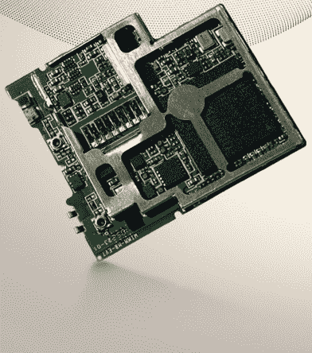

# 微型 WIMM 通信设备支持可穿戴通信技术

> 原文：<https://web.archive.org/web/https://techcrunch.com/2011/08/02/the-tiny-wimm-communications-device-allows-for-wearable-communications/>

# 微小的 WIMM 通信设备允许穿戴式通信

就像一个小型化的、可穿戴的小家伙，WIMM 微型通讯设备看起来很有趣，如果有足够的支持和兴趣，实际上*也会变得*有趣。该设备看起来像一个微型的 iPod Nano，但具有 Wi-Fi 和蓝牙功能。它应该可以很好地与你的 Android 手机兼容，并运行自己的精简版 Android 来显示信息，处理运动监控，并可能运行其他人会编写的小应用程序。

这种设备不太好卖。事实上，它更像是一个供其他人构建的平台(就像 Chumby 一样)，你可以为兼容 WIMM 的设备编写应用程序，这些应用程序应该可以在整个范围内工作。该平台表面上是开放的，但制造商必须获得技术许可才能构建类似的技术。

您可以使用这些[工具](https://web.archive.org/web/20230203054313/http://www.wimm.com/developers.html)为平台开发，被许可方可以使用开发硬件来规划他们自己的 WIMM 兼容设备。

> WIMM 平台的基础是一个优雅、简单的触摸屏界面，它隐藏了底层技术的复杂性和强大功能。WIMM 模块可以加载各种基于 Android 的微型应用程序，这些应用程序是使用开放的 SDK 创建的。此外，它还可以与 Android、黑莓和 iOS 设备无缝兼容。对于合作伙伴来说，它提供了一个可轻松定制的开放平台；对于消费者来说，它提供了一目了然的不间断信息。

它会起飞吗？在我漫长的历史中，我从来没有见过一个有效的、受欢迎的可穿戴信息设备，但是，我又知道什么。也许这些是下一个星际迷航通讯器。您可以在此预订 2011 年第三季度上市的开发设备[，大胆尝试许多人曾经去过的地方。](https://web.archive.org/web/20230203054313/http://www.wimm.com/developers.html)

[产品页面](https://web.archive.org/web/20230203054313/http://www.wimm.com/)

【YouTube = http://www . YouTube . com/watch？v=zUGheQ7OT8I]