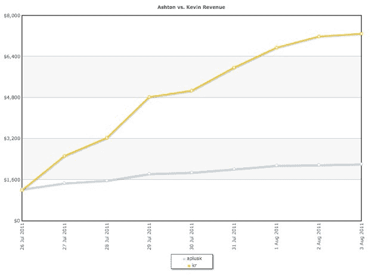

# 阿什顿·库彻和凯文·罗斯，谁的微博更有价值？TechCrunch

> 原文：<https://web.archive.org/web/http://techcrunch.com/2011/08/03/kutcher-rose-tweets-fab/>

# 阿什顿·库彻和凯文·罗斯，谁的微博更有价值？

谁的推文带来了更多的实际销售，阿什顿·库彻还是凯文·罗斯？答案并不明显。库彻自诩拥有 730 万 Twitter 粉丝，而罗斯只有 130 万，但设计购物网站[Fab.com](https://web.archive.org/web/20230205035525/http://fab.com/)最近开展的一项促销活动表明，原始数据并不总是能转化为更多的销售。

库彻和罗斯最近都在推特上发布了一个链接，让他们的粉丝在 Fab.com 购买任何商品都可以优惠 10 美元。Fab 写了一篇关于市场测试的[博文](https://web.archive.org/web/20230205035525/http://betashop.com/post/8430505093/fab-com-celebrity-blastoff-ashton-kutcher-vs-kevin)。库彻的链接导致了 5888 个注册，比罗斯的 4356 个多(但也没多多少)。但是罗斯的关系带来了更多的订单和更高的收入。

罗斯的更多追随者传递了这个链接，他们也订购了更多。在促销的第一天，库彻的追随者下了 45 份订单，而罗斯的追随者下了 30 份订单。但是库彻追随者的日订单量最高为 75 份，而一周后罗斯的日订单量最高为 158 份(见图表，罗斯的是黄色线)。就总销售额而言，罗斯带来了 7121 美元，而库彻只有 2183 美元。

这些正是更多创业公司应该报告的指标。他们得到的是每股价值，比通常的[虚荣心指标](https://web.archive.org/web/20230205035525/https://techcrunch.com/2011/07/30/vanity-metrics/)要有用得多。库彻和罗斯都是 Fab 的投资者，Fab 最近从同性恋社交网站转型为购物网站。

在社交商务中，利用名人来促进销售是一种日益增长的趋势。吉尔特最近与 Lady Gaga 的粉丝进行了接触，One Kings Lane 与 Bravo 秀的设计师进行了推广。

