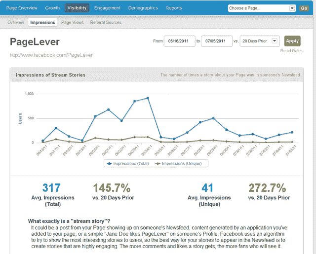

# YC 资助的 PageLever 提供了对脸书分析的深入见解 TechCrunch

> 原文：<https://web.archive.org/web/https://techcrunch.com/2011/08/03/yc-funded-pagelever-offers-deeper-insight-into-facebook-analytics/>

脸书可能有成群的出版商、品牌、名人和其他主要实体使用脸书页面，但其内部分析产品——Insights——仍有许多需要改进的地方。现在，Y Combinator 资助的初创公司 [PageLever](https://web.archive.org/web/20230203141943/http://www.pagelever.com/) 希望为拥有大量粉丝(超过 10，000 人)的页面提供工具，帮助他们更好地确定应该与粉丝分享什么。

几年前在 TechCrunch 实习的联合创始人杰夫·维德曼(Jeff Widman)表示，随着功能集的增加，这项服务自 1 月份以来一直在悄悄地运营。它还吸引了一些知名客户，包括 YouTube、Mint 和 Kayak.com。

PageLever 的一个关键功能是能够跟踪脸书页面上给定的更新在一段时间内的进展情况——关于新交易的状态更新很快就消失了，还是在发布一天后人们仍在评论它？PageLevel 将分析数据并生成一个“参与时间表”，这样你就可以很容易地跟踪哪些帖子具有持久力。

不幸的是，在追踪这些帖子的传播范围时，脸书只给了 PageLever 断断续续的数据，所以这些时间表会有点不稳定。但总比没有好。

另一个关键特性:PageLever 可以让你分析哪些状态更新促使你的用户“不喜欢”你的页面。PageLevel 还可以让你看到一个页面的更新到达了多少人，而不仅仅是显示的数量(有些人看到很多更新，有些人没有)。

对于拥有 5 个页面和多达 5 万名粉丝的品牌，该服务的计划从每月 34 美元开始，一直到每月 94 美元(这可以为多达 500 万名粉丝以及多个用户帐户提供支持)。拥有更大粉丝群的品牌计划也是可行的。

当然，脸书最终可能会决定自己免费提供所有这些功能。但威德曼认为，即使出现这种情况，脸书也会让自己的 API“领先”于自己发货的产品，让第三方有能力把自己的产品做得更好。我们走着瞧。

但是，除了脸书本身，PageLevel 也将与其他分析产品竞争，如 [Wildfire](https://web.archive.org/web/20230203141943/http://www.wildfireapp.com/) 、 [AllFacebook Stats](https://web.archive.org/web/20230203141943/https://www.allfacebookstats.com/) 和 [Involver](https://web.archive.org/web/20230203141943/http://www.involver.com/) 。

