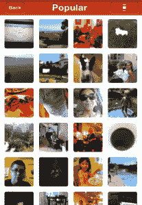

# GLMPS 推出了一款很酷的新照片分享应用，带有视频扭曲功能 TechCrunch

> 原文：<https://web.archive.org/web/https://techcrunch.com/2011/08/04/glmps-launches-a-cool-new-photo-sharing-app-with-a-video-twist/>

你可能已经注意到了，现在市场上有一些照片分享应用。事实上，有足够多的选择，TechCrunch 自己的 Alexia Tsostsis 和前 Myspace 营销人员 Sean Percival [创建了一个流程图](https://web.archive.org/web/20230203071322/https://techcrunch.com/2011/06/15/what-photo-sharing-app-should-you-use/)来帮助你找到正确的应用程序。这是一个虽然受欢迎，但急需一些新鲜想法的空间。因此，从今天开始，App Store 上又多了一款照片分享应用，但这款有一个非常酷的转变。

总部位于旧金山的 [GLMPS](https://web.archive.org/web/20230203071322/http://www.glmps.com/) 成立于 2010 年，是一家自助创业公司，今天发布了其同名的 [iPhone 应用](https://web.archive.org/web/20230203071322/http://itunes.apple.com/us/app/glmps/id452548312?mt=8)，该应用提供了一种被初创公司比作“可视化状态更新”的体验。这到底是什么意思？简而言之:GLMPS 将视频与传统的图像捕捉结合在一起，因此在人们拍照前的大约 5 秒钟，该应用程序会以快速、简短的视频形式捕捉到照片。

本质上，这类似于“在你的照片上按下 play”，因此当你观看静止图像时，一个小缩略图出现在屏幕的右下角，显示视频捕捉前的瞬间——或暂停。gif —表单。

 一旦用户捕捉到他们的照片，照片视频就会加载到他们的 iPhone 照片库中，然后，像其他照片分享应用程序一样，他们可以通过脸书、Twitter、Foursquare、Tumblr、电子邮件、短信等轻松分享这些照片。在今天的发布会上，GLMPS 与 Foursquare 等合作，为签到体验增加了一个更加丰富的照片视频层。

这是一个伟大的想法，而且是那些简单的想法之一，一旦你看到它在行动，很难相信它以前没有被做过。在以视频形式拍摄照片之前添加一些自发的瞬间，简单地回顾一下过去，是一个很棒的功能。感觉还没完成，但潜力很大。问问斯考伯就知道了。

GLMPS 目前在 iPhone 上是免费的，Android 应用程序(以及其他)也将在不久的将来推出。包括 Paul Robinett、Nick Long 和 Esther Crawford 在内的 GLMPS 团队也将很快增加将“glmpses”缝合在一起的能力，以便根据时间、标签和位置，从个人或团体的角度创建用户照片-视频库的精彩片段。

“我们今年早些时候看到了 GLMPS，与 foursquare 平台集成是显而易见的，”Foursquare 移动和战略合作伙伴 Holger Luedorf 副总裁说。“GLMPS 通过提供快速、丰富的瞬间快照，丰富了登机体验。我们的目标是为我们的数百万用户和我们的品牌合作伙伴提供终极参与体验，GLMPS 是 foursquare 生态系统中每个人的强大工具”。

欲了解更多信息并从今天开始享受生活，请访问 http://www.glmps.com。