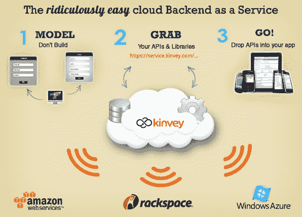

# 金维为其“后端即服务”产品 TechCrunch 完成$2M 种子轮

> 原文：<https://web.archive.org/web/http://techcrunch.com/2011/08/04/kinvey-closes-2m-seed-round-for-its-backend-as-a-service-product/?utm_source=feedburner&utm_medium=feed&utm_campaign=Feed:+Techcrunch+(TechCrunch>)

# 金维为其“后端即服务”产品完成$2M 种子轮

大多数开发者都会同意:建立后台并不有趣。这就好比你要开始打造自己的梦想游戏，然后在渲染引擎上花费两个月的时间，等到你完成了大多数人甚至都没有意识到的工作，你就没有精力去打造那些有趣的东西了。

2011 年在波士顿成立的 TechStars 初创公司金维(Kinvey)的“后端即服务”(后端即服务)产品 2M 回合刚刚结束，该产品旨在让移动开发人员跳过所有乏味的数据库建设，直接进入有趣的领域。

金维的工作原理:

或者，以一种不那么深奥的方式:

*   开发人员构建他们的数据库的可视化模型
*   金维会生成 API(与 iOS、Android、Windows Phone 7、BlackBerry 和 HTML5 兼容)，开发人员只需在代码中插入这些 API，就可以完成从后端存储和检索数据的所有繁重工作。
*   所有通过金维存储的数据都通过四个服务进行冗余备份:Amazon EC2、Microsoft Azure、Rackspace 和金维自己的服务器。即使一个或两个服务关闭，您的数据库仍然可以访问。

金维在寻找开发者方面非常成功——甚至比他们预期的还要成功。他们推出后第一个月的目标是让大约 30 个开发者加入这项服务；相反，他们有 150 个。如今，他们已经有大约 500 名开发人员基于该产品进行开发。

在 Beta 测试期间，金维对开发者来说是完全免费的，测试将持续到今年秋天产品正式发布。可惜，它们的确切定价模式仍有待确定。

这一轮 100 美元的 2M 融资由 Atlas Venture 牵头，Avalon Ventures 提供支持。金维表示，这笔资金将主要用于发展团队，同时打造附加第三方数据服务和应用分析等功能。