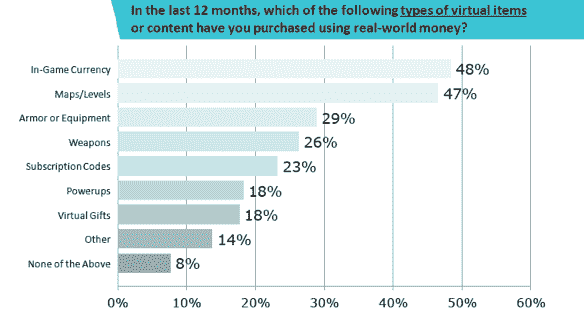

# 报告:越来越多的游戏玩家在虚拟商品上使用真金白银；女性更有可能使用脸书信用 TechCrunch

> 原文：<https://web.archive.org/web/https://techcrunch.com/2011/08/04/report-more-gamers-are-using-real-money-on-virtual-goods-women-more-likely-to-use-facebook-credits/>

# 报告:越来越多的游戏玩家在虚拟商品上使用真金白银；女性更有可能使用脸书信用

Visa 旗下的 PlaySpan 与研究公司 VGMarket 发布了一项新的研究，内容是关于游戏玩家在虚拟商品上的消费方式和消费金额。根据这项研究，近三分之一的普通游戏玩家使用真实世界的货币(而不是虚拟货币)来购买虚拟商品。使用真实世界货币的虚拟购买中，在线游戏占大多数(51%)，其次是社交网络游戏(30%)。

该报告显示，48%的普通玩家在过去 12 个月中购买了游戏内货币，就购买频率而言，57%的普通玩家表示，他们每月至少使用现实世界的货币购买一次虚拟物品，72%的普通玩家表示，他们将花费更多或与去年持平。

总体而言，女性(34%)使用脸书信用点购买虚拟物品或内容的可能性几乎是男性(13%)的三倍，在过去 12 个月中，女性在大型多人在线游戏和休闲游戏中购买虚拟物品的比例超过了男性。

在休闲游戏方面，差异甚至更大，女性在第一方发行商的花费比男性多 40%，在第三方发行商的花费是男性的三倍多。研究显示，女性(37%)购买虚拟物品来装饰网页、角色或头像的可能性几乎是男性(19%)的两倍。

在推销虚拟货币商品时，男性和女性更喜欢的沟通方式似乎也大相径庭。男性(49%)比女性(38%)更容易接受电子邮件交流，而女性(31%)比男性(18%)更喜欢在脸书获得晋升。

虽然这份报告显示女性在虚拟物品上的花费超过男性，但其他报告[显示](https://web.archive.org/web/20230203042500/http://venturebeat.com/2011/05/27/attention-shoppers-men-outspend-women-9-to-1-on-mobile-virtual-goods/)男性在虚拟物品上的花费远远超过女性。也许现在女性花更多的时间在社交和休闲游戏上？

