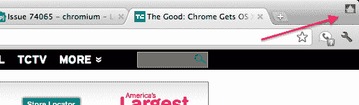

# Chrome Lion 全屏支持已准备就绪，包括带标签和不带 TechCrunch

> 原文：<https://web.archive.org/web/http://techcrunch.com/2011/08/05/chrome-for-mac-os-x-lion/>

# Chrome Lion 全屏支持已经准备好了，有标签和没有标签

继我们之前报道的 OS X 狮子的谷歌 Chrome 浏览器之后，看起来开发进度比预期的要快。具体来说，滑动手势支持已经完全实现了(现在也朝着正确的方向)，现在一个合适的全屏模式也已经进入了浏览器的金丝雀版本。

在 Lion 几周前发布后不久，我们注意到 Chrome 运行正常，但有点不稳定。因为 Lion 默认改了一些手势，页面划动坏了。Chrome 自己的全屏模式与 Lion 内置的功能并不兼容。正如 Chrome SVP 桑德尔·皮帅所说，谷歌正在解决这些问题，但指出“这需要一些时间”。

在那之后的几周里，Chrome 的开发和测试版变得相当不可靠，经常崩溃。这使得许多 Mac 版 Chrome 用户转向苹果自己的浏览器 Safari。但如果 Chrome 最新的金丝雀版本有任何暗示的话，谷歌正在努力让 Chrome 在 Mac 上恢复速度。

[正如 MacStories](https://web.archive.org/web/20230205043418/http://www.macstories.net/news/latest-chrome-canary-build-has-fullscreen-for-lion-built-in/) 首先注意到的，全屏支持现在完全融入了 Chrome Canary。太棒了。关于该功能是否应该像以前一样工作——完全没有浏览器 chrome(小写)显示——或者是否应该像 Safari 一样工作，全屏显示标签页，曾经有过一些争论。嗯，谷歌实现了两种方式。默认情况下，当你进入全屏，你会看到标签，但一个新的“窗帘”按钮删除标签，让你真正的全屏体验。(当您将鼠标悬停在屏幕顶部时，选项卡仍会弹出。)

基于手势的页面滑动[在几周前](https://web.archive.org/web/20230205043418/https://techcrunch.com/2011/07/26/chrome-14-os-x-lion-gestures/)被修复，但是与 Safari 相比，谷歌向后实现了它。[正如你在 Chromium 板](https://web.archive.org/web/20230205043418/http://code.google.com/p/chromium/issues/detail?id=78676&q=os%3DMac%20gesture&sort=-modified&colspec=ID%20Stars%20Pri%20Area%20Feature%20Type%20Status%20Summary%20Modified%20Owner%20Mstone%20OS)中看到的，我们的故事为团队标记了这个问题，他们很快修复了它。

金丝雀频道的 Chrome 最新版本是 15。Chrome 的开发版本仍然是 14 个，所以 15 个变化应该很快就会出现。那么它在所有 Chrome 频道推出还需要几周时间。但是请放心，完全符合 Lion 标准的 Chrome 正在路上。

