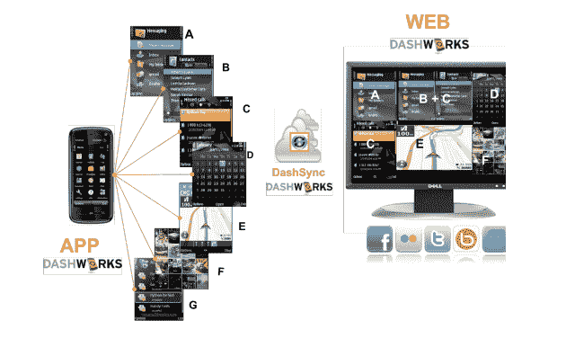

# HTC 以 1850 万美元收购移动网络服务公司 dash wire TechCrunch

> 原文：<https://web.archive.org/web/https://techcrunch.com/2011/08/05/htc-buys-mobile-web-services-company-dashwire-for-up-to-18-5-million/>

# HTC 以 1850 万美元收购移动网络服务公司 Dashwire

台湾智能手机制造商 HTC 今天上午宣布，它已同意通过其 HTC America 控股公司收购西雅图移动网络连接服务公司[dash wire](https://web.archive.org/web/20230203044503/http://www.crunchbase.com/company/dashwire)100%的股份，最高收购价格为 1850 万美元，以促进其在 HTCSense.com[的移动云服务产品。](https://web.archive.org/web/20230203044503/http://htcsense.com/)

Dashwire 为移动运营商、设备制造商和零售商提供一系列消费、社交和设备管理软件服务。该公司的平台可用于 Android、Windows Mobile、Symbian 和黑莓。

Dashwire 在其网站上说，它得到了投资者的支持，这些投资者在 McCaw Cellular、Western Wireless、Voicestream、Nextel、中国联通和微软“建立了无线和技术产业”。

另一个投资者是零售巨头的投资部门百思买资本(Best Buy Capital)。

去年年底，Dashwire [通过债务融资筹集了 100 万美元](https://web.archive.org/web/20230203044503/https://techcrunch.com/2010/12/28/dashwire-raises-another-1-million-for-mobile-services-platform/)。

该公司由首席执行官福特·戴维森创建，他曾是微软移动设备部门的产品经理。Dashwire 的首席技术官詹姆斯·普鲁登特在早期帮助建立了亚马逊网络运营的关键要素，也帮助创建了亚马逊移动集团。

相关:

[智能手机制造商 HTC 以 3 亿美元收购 WTI 威盛公司的 S3 显卡](https://web.archive.org/web/20230203044503/https://techcrunch.com/2011/07/06/smartphone-maker-htc-buys-s3-graphics-from-via-wti-for-300-million/)

[HTC 投资多媒体交付平台公司 Saffron Digital](https://web.archive.org/web/20230203044503/https://techcrunch.com/2011/02/07/htc-invests-in-multimedia-delivery-platform-company-saffron-digital/)

