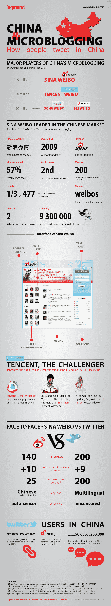

# 腾讯与新浪:看谁将赢得中国推特之战[信息图]

> 原文：<https://web.archive.org/web/http://techcrunch.com/2011/08/05/tencent-vs-sina-a-look-at-whos-winning-the-battle-for-chinas-tweets/>

中国目前拥有世界上最多的互联网用户，大约有 4 . 2 亿人连接到网络。一些[更近的统计](https://web.archive.org/web/20230203131044/http://www.pcworld.com/businesscenter/article/235978/china_reaches_485_million_internet_users_as_growth_slows.html)甚至把这个数字提到了 4.85 亿。诚然，中国人口刚刚超过 13 亿，这意味着只有 32%的人口在使用互联网，这一比例远远低于美国和日本(分别为 77%和 78%)。

当然，随着中国的网络活动继续快速增长，这个亚洲大国代表了一个巨大的数字市场，尽管所谓的[“中国防火长城”](https://web.archive.org/web/20230203131044/http://en.wikipedia.org/wiki/Great_Firewall_of_China)很难(或不可能)将国际数字技术和业务完全传输到中国生态系统中。

由于中国严格的网络监管(以及知识产权封锁等)，从大的方面来看，美国企业未能产生重大影响，尽管中国的网络用户已经开始兴致勃勃地采用社交网络、微博、游戏等。

例如，自 2009 年以来，Twitter [在中国被屏蔽，但这并没有阻止中国公司在国内采用类似 Twitter 的微博平台。在过去的几年里，“微博”网站(中文翻译为“微博”)的使用在中国爆炸式增长，特别是两家公司已经开始主导市场:腾讯和新浪。](https://web.archive.org/web/20230203131044/http://en.wikipedia.org/wiki/List_of_websites_blocked_in_the_People's_Republic_of_China)

当然，在中国的“微博竞赛”中，哪家公司会胜出还有待商榷。原因在于，正如 iChinaStock.com 所说，腾讯本质上已经变成了 AIM、Myspace、脸书和 Twitter，如果它们合并成一个庞大的合并企业。

腾讯的即时通讯应用程序 QQ Messenger(又名 QQ)声称拥有 6.74 亿活跃用户(尽管这个数字很可能高达几亿)。腾讯通过 QQ 注册用户，然后将他们引入其他产品和服务，包括游戏、搜索和腾讯微博等。

根据 iChinaStock 的说法，微博在中国真正腾飞是随着 2009 年和 2010 年新浪微博人气的上升；如今，这一广受欢迎的微博服务拥有近 1.4 亿用户。然而，自从腾讯在 2010 年推出腾讯微博以来，其服务也一直在以极快的速度增长，今天声称超过 [2 亿注册用户](https://web.archive.org/web/20230203131044/http://news.ichinastock.com/2011/06/tencent-weibos-accelerating-growth-200-million-users-115-million-active/)。

然而，iChinaStock 估计，这些用户中只有大约 9300 万人活跃在这项服务上，尽管这个数字仍有争议，但很可能有多达 40%的腾讯微博用户通过 QQ 注册，这使得这些注册数据居高不下，而事实上这些用户中有许多甚至都不活跃。

和往常一样，识别“注册”用户和“活跃”用户是一个微妙的问题，当涉及到这些中国微博服务时，许多数据要么是未公布的，不可靠的，要么是一个估计。

然而，关于哪家公司将赢得这场竞赛， [Digimind](https://web.archive.org/web/20230203131044/http://www.digimind.com/) 是一家提供竞争情报以及电子声誉、数据挖掘和社交媒体监控的解决方案提供商，它制作了一张漂亮的小信息图，让我们得以一窥微博大战，以及领导者如何与 Twitter 抗衡。(见下文)

虽然 Digimind 将新浪微博作为中国微博领域的明确领导者，但腾讯肯定不会被忽视，因为它正在呈指数级增长，拥有一个集成的多层次平台，可以将用户引入其微博，并且正在[花费数百万](https://web.archive.org/web/20230203131044/http://digicha.com/index.php/2011/06/will-tencents-weibo-spending-spree-destroy-sina-weibos-profit-potential/)进行营销，以吸引新用户使用其服务。

话虽如此，我在 Digmind 采访过的人，以及中国的消息人士(还有 iChinaStock)都同意，新浪微博在活跃用户数量和质量方面可能都超过腾讯。新浪拥有中国微博市场 57%的份额，并在中国名人中拥有很高的采用率(更不用说拥有一个相对稳定的平台，没有太多宕机)，新浪看起来显然是领先者。更不用说该公司收购了“Weibo . com”和“Weibo . cn”——这两个域名对于一家寻求主导微博市场的公司来说相当重要。另外，它们更容易记住。

虽然新浪微博在中国的应用情况比 Twitter 好，但事实是 Twitter 的覆盖范围更广，现在被翻译成 11 种语言，而新浪和腾讯仍然局限于中国市场。(尽管新浪微博[正计划在不久的将来推出英文版](https://web.archive.org/web/20230203131044/http://www.huffingtonpost.com/2011/06/09/china-sina-weibo-english_n_873982.html)。)当然，这可能是因为市场太大，两家公司都不会成为“中国的 Twitter”，尽管新浪微博在这一点上显然具有竞争优势。

然而，随着腾讯更广泛的平台和专利所有权进入即时通讯、电子商务、在线支付服务、搜索、信息安全和游戏等领域，腾讯至少可以说是多元化的。此外，随着 QQ 的大规模采用，或许腾讯首先获得了一个更大的奖项:中国的社交网络。

让我们知道你的想法。

延伸阅读:要想对新浪微博和腾讯(以及腾讯微博)进行真正出色的比较，请查看 iChinaStock.com 的分析[这里](https://web.archive.org/web/20230203131044/http://news.ichinastock.com/2011/05/inside-tencent-weibo-slideshare/)，以及 DigiCha 的比尔·毕晓普的分析[这里](https://web.archive.org/web/20230203131044/http://digicha.com/index.php/2011/05/can-tencent-weibo-threaten-sina-weibo/)。

事不宜迟，信息图:

*节选图片由 [Technode](https://web.archive.org/web/20230203131044/http://technode.com/)* 提供