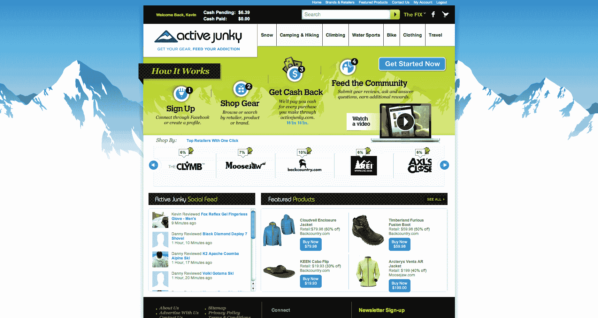

# 活跃的瘾君子希望成为你户外装备的在线资源(并给你返现)

> 原文：<https://web.archive.org/web/http://techcrunch.com/2011/08/08/activity-junky-wants-to-be-your-go-to-online-resource-for-outdoor-gear-and-give-you-cash-back/>

对于喜欢户外运动的人来说，有数百个地方可以在线购买装备和服装。户外运动者和女性可以简单地访问他们最喜欢的品牌网站，无论是 REI，Backcountry，Moosejaw，还是 Patagonia，但在户外零售中真的没有太多的聚集方式。(尽管也有像 [GearZone](https://web.archive.org/web/20230203092954/http://www.gear-zone.co.uk/) 这样的欧洲网站。)随着比较购物、忠诚度、折扣和优惠券网站在利基垂直市场的兴起，户外行业找到自己的出路是很自然的。

[Active Junky](https://web.archive.org/web/20230203092954/http://www.activejunky.com/) 是一家成立于 2009 年的初创公司，本周重新启动，旨在成为一个利基资源，汇集户外装备和服装行业的最大品牌，并允许用户分享他们对这些零售商的看法，并获得现金购买。

Active Junky 正在与 100 多家分支机构合作，包括上文提到的那些分支机构，为零售商创造一个竞争激烈的市场，其中最大的品牌将根据他们通过 Active Junky 可以赚取多少现金来争夺新客户，考虑到一双新滑雪板的价格，这可能会引起现金短缺的户外运动爱好者的兴趣。

Active Junky 本质上是户外行业的一种 [Ebates](https://web.archive.org/web/20230203092954/http://www.ebates.com/) 类型的现金返还模式，用户可以浏览网站上超过 80，000 种产品的数据库，比较零售商的价格，点击进入零售商的网站购买产品，每次购买都可以获得现金返还。([户外市场的店铺风格](https://web.archive.org/web/20230203092954/http://www.shopstyle.com/)遇上 Ebates。)

每三个月，Active Junky 会兑现一个用户的“Junky 账户”，此时它会将用户的账户存入 Paypal，或者将现金捐赠给初创公司的非营利合作伙伴，如大自然保护协会。

然而，创始人兼首席执行官 Kevin McInerney 表示，这家初创公司的目标不仅仅是创建一个纯粹的优惠券或交易网站，复制和粘贴 Ebates 或 [Fat Wallet](https://web.archive.org/web/20230203092954/http://www.fatwallet.com/) 模型，而是围绕户外运动世界创建一个全方位服务的社区。Active Junky 不仅允许用户比较户外品牌装备的价格并进行购买，还提供探险旅行、运动新闻、原创视频以及网站作者和用户对装备的评论。

在不久的将来，Active Junky 计划推出一个奖励系统，一个 la [Gogobot](https://web.archive.org/web/20230203092954/http://www.gogobot.com/leaderboard) 或 [Consmr](https://web.archive.org/web/20230203092954/http://www.consmr.com/) ，在这个系统中，用户将被激励去写关于产品和装备的长篇详细评论。用户写的评论越多，他们在网站上越活跃，他们就会获得徽章和奖励，以及初创公司零售合作伙伴的折扣和交易。该网站还设有一个“社交墙”，用户可以在那里跟踪他们的朋友正在购买和评论什么，并发布对装备的推荐或建议。

在目前的形式下，Active Junky 将自己定位为户外品牌的联盟营销平台，为这些品牌的网站带来流量，并通过合作伙伴关系，从销售和广告活动增加的收入中提成。虽然所有行业的品牌已经通过奖励计划、忠诚度、比较购物和各种第三方策略利用联盟营销一段时间了，但消费者往往不知道这些合作关系以及比较或现金返还网站(如 Active Junky)如何从这些关系中获利。

McIerney 说，他希望 Active Junky 在这些形式上尽可能透明，并让网站用户了解它从零售合作伙伴那里获得的佣金，包括向用户提供这些利润的大部分。

McInerney 说:“最终，因为这是用户的购买，因为这是他们的 cookie，我们正在跟踪，我们希望我们的客户体验这种关系的好处”。*“我们希望客户信任我们，我们认为透明度和利润分享是实现这一目标的好方法”。*

Active Junky 目前已经筹集了 15 万美元的天使资金，并正在寻求进一步的投资，因为它正在推进其奖励计划。

更多信息，请查看下面的视频，并告诉我们您的想法。Active Junky 如何更好地服务其用户，成为户外行业的首选利基资源？

[YouTube = http://youtu . be/pBWBapxKQgg]