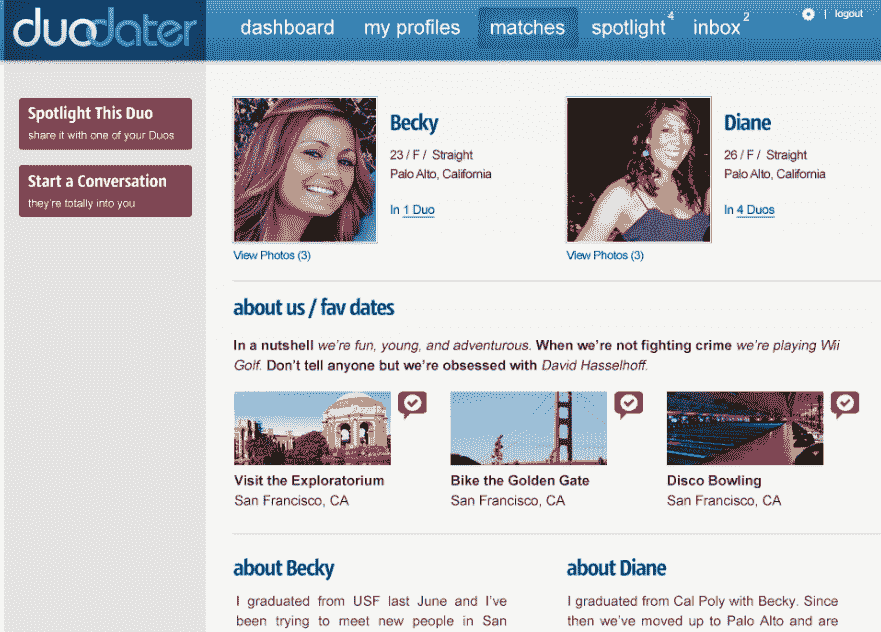

# DuoDater 希望让网上约会变得更社交化，不那么尴尬

> 原文：<https://web.archive.org/web/http://techcrunch.com/2011/08/08/duodater-wants-to-make-online-dating-more-social-and-less-awkward-invites/>

上个月，Nick Paumgarten 为《纽约客》*撰写了一篇长篇文章,详细描述了在线约会的兴起及其对网络文化的影响。除此之外，Paumgarten 提到了一些令人瞠目结舌的行业统计数据，包括收费约会网站已经成为一个价值数十亿美元的行业，“六分之一的新婚是在互联网约会网站上相遇的结果”，以及在线约会现在是人们见面的第三种最常见方式。*

 *虽然使用在线平台追求关系的早期羞耻感(或耻辱)正在消退，但一直存在的一些相同摩擦仍然存在:从在线到线下互动的尴尬，遇到陌生人的潜在危险，依赖算法找到你的“匹配”等。具有讽刺意味的是，作为社交服务商，大多数在线约会网站都试图将用户与新认识的人联系起来，但却与他们的实际社交生活脱节。正如 Paumgarten 指出的，网上约会仍然是固有的孤立。

迈克尔·帕里克和安德鲁·弗拉克纳是一家名为 [DuoDater](https://web.archive.org/web/20230203041601/http://www.duodater.com/) 的新约会网站的联合创始人，他们一致认为，目前的在线约会方式(以及一般的约会)仍然存在一些非常基本的问题。创建网上约会档案可能很困难；联合创始人说，很难找到合适的关于你自己的话来帮助网站，无论是否基于算法，帮助你找到合适的人。更不用说给一个陌生人发信息可能是一个有点紧张的过程，在没有太多背景知识的情况下与他们见面是尴尬的，有时甚至是不安全的。

因此，这家总部位于旧金山的初创公司提供了一个平台，旨在比当前约会网站倡导的模式——双人约会——更具社交性，或许更少恐吓。DuoDater 的目标是 20 多岁和 30 多岁的男性和女性，他们希望在副驾驶的帮助下社交和结识新朋友。联合创始人认为，通过允许用户在约会时有一个朋友在身边，互动可以更加自然，并且(希望)是社交和交友的一种不那么尴尬的方式。

DuoDater 的结构也使创建约会档案的过程不那么伤脑筋。该网站提供“二人简介”，只要求用户写几句关于自己的话，这样主要的吸引力就转向创建一个共同的描述，这对约会者可以一起填写。Flachner 说，到目前为止，DuoDater 的用户发现这是一种问题更少、更令人愉快的交友方式。

创始人还认为，他们的模式提供了比单独约会固有的更高层次的责任，因为用户不太可能使用欺骗的照片角度和夸张或浪漫的描述，因为他们知道密友会看到它，可能会打电话给他们。

DuoDater 还增加了“特色日期”的想法，以便新用户可以更容易地下车和运行，并出去测试模型。

当我问创始人他们是否考虑过集体约会时，他们说，他们的市场研究和尽职调查表明，用户更喜欢双人约会，因为这仍然提供了一定程度的亲密，使体验感觉像一次真正的约会，而不是一次松散的社交聚会。

创始人表示，虽然有一些成功的群体交友网站，但群体简介会转移对个人的关注，为一大群人组织一次郊游可能会很麻烦——这是许多人都熟悉的事情。

当然，DuoDater 模式的内在风险是，约会领域的大型参与者之一，如 Match.com、eHarmony、PlentyOfFish 和 OK Cupid，可能会建立自己的双重约会服务，并在用户群方面迅速击败初创公司。但 Flachner 表示，他认为 DuoDater 是一个很好的替代选择，因为它专注于双人约会的休闲氛围，以事件和经历为中心，而不是依赖算法模型(一种潜在的不太“人性化”的方法)来连接实际的人。

DuoDater 为传统的约会模型提供了一个有趣的旋转，真的，这是一个奇迹，这个模型没有被大规模实施。当然，这可能是有充分理由的；如果没有收费模式，约会网站很难赚钱，而且双重约会本身也带来了挑战。

DuoDater 目前是免费使用的，由于这家初创公司目前正在启动，它将依赖其测试版来测试这种方法是否真正可行，是否可以扩展。收费的高级服务也可能在它未来的路线图上，这可能包括形成更多的双人组，张贴更多的图片等能力。或者从餐馆、音乐会场所和其他付费的企业那里获得了十二月的创意，也是一种选择。

对于希望对双约会平台进行一些早期测试的读者来说，请点击进入[DuoDater.com](https://web.archive.org/web/20230203041601/http://www.duodater.com/)，并输入“TECHCRUNCH”邀请代码进行访问。

让我们知道你的想法。*