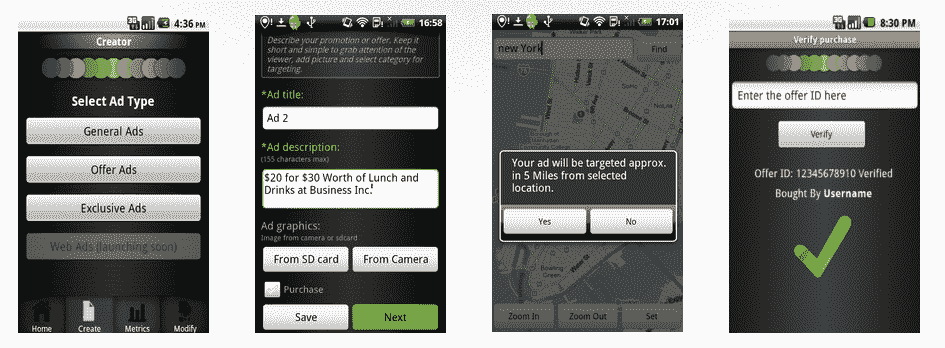

# adbalancing 在 Android 上推出测试版，帮助中小企业在移动 TechCrunch 上完成赎回循环

> 原文：<https://web.archive.org/web/http://techcrunch.com/2011/08/09/adlibrium-launches-in-beta-on-android-to-help-smbs-close-the-redemption-loop-on-mobile/>

成立于 2008 年的广告和社交媒体初创公司 Camber Tech 今天正式透露，它已经从一批国际天使投资者那里筹集了 150 万美元的种子资金。这家初创公司计划利用最近注入的资本来加大营销力度，并继续其移动应用的跨平台开发。

2010 年初，在海地发生毁灭性地震后不久，Camber Tech 应邀参加了[克林顿全球倡议](https://web.archive.org/web/20230203122054/http://www.clintonglobalinitiative.org/)，当时这家初创公司正致力于创建本地网络平台，以加强冲突地区的商业、新闻和媒体。然而，由于当地在语言和商业习惯上的摩擦，这个计划被放弃了。

然而，受到这一事件的启发，这家初创公司仍然决心继续致力于实时原因营销解决方案，这可能会有真正的全球应用，并帮助解决当地商业的一些大问题。经过几个月的工作，Camber Tech [宣布了与前总统克林顿](https://web.archive.org/web/20230203122054/http://www.clintonglobalinitiative.org/commitments/commitments_search.asp?Section=Commitments&PageTitle=Browse%20and%20Search%20Commitments&id=695065)的新承诺，即“在六年的时间里，通过其移动广告平台，帮助为非营利组织和社会事业筹集资金和提高认识”。

因此，根据 Camber Tech 联合创始人兼首席执行官 Shaunak Khire 的说法，利用这笔新资金和与克林顿全球倡议的合作伙伴关系，Camber Tech 开发了一个在移动设备上运行的本地移动广告和营销平台——最初只在 Android 上免费，iOS 将在不久的将来推出。

从本质上来说，该平台，今天在私人测试中推出，使小型，本地企业和商人能够轻松有效地创建广告和营销活动，提供促销，交易，等等。adlimination 希望鼓励这些传统上难以将线下业务带到线上的中小企业实现数字化，并开始通过一个关键的接入点与客户联系和互动:他们无处不在的移动设备。

通过 adlimination，商家和当地企业可以创建固定价格和时间敏感的当地优惠和广告活动，所以从某种意义上说——对于那些熟悉这个领域的人来说——adlimination 是一个当地商业平台(以应用程序的形式)，其核心是一点点 [AdWords](https://web.archive.org/web/20230203122054/http://adwords.google.com/) 和即时优惠，带有一丝 [Lockerz](https://web.archive.org/web/20230203122054/http://lockerz.com/) 。

除此之外，在 adliminary 的例子中，其广告平台的一个漂亮的特点是，它为企业提供了查看分析(如浏览量、通话量、位置、购买量)的能力，然后获取这些数据并将其用于重新定位——直到个人印象。adliminary 通过允许商家输入 ID 来实现交易和验证，这与 GrouponNow 有点类似，主要区别在于 adliminary 不收取佣金。

通过允许客户看到广告，根据该广告进行交易或购买，然后允许商家跟踪和分析这些交互产生的数据(以便未来重新定位)，adlimination 正在努力关闭赎回循环，这是当地商业的一个重要目标，我的同事 Erick Schonfeld [最近写了详细的文章](https://web.archive.org/web/20230203122054/https://techcrunch.com/2011/07/24/redemption-loop-local-commerce/)。

更重要的是，该平台让商家有机会向他们的客户提供三种不同类型的广告或促销活动:一般广告(纯文本)；优惠；还有独家优惠，比如“在一定时间内拥有这个位置”的形式。这些广告的分发完全是客户自愿选择的，这是一个很好的接触，因为它允许客户进行一些控制。

那么，对于 adbalancing 来说，目标不仅是提供可以在各个方面进行控制的活动，无论是性别、类别还是位置，而是通过允许商家自动将客户数据输入到他们的数据库中，从而允许他们通过会员卡、个人优惠等轻松实现未来的重新定位，从而努力结束兑换循环。

另一个帮助它接近尾声的很酷的功能是:对于用户选择的每一个提议，他们都可以获得一个平衡硬币，然后可以在特定的商家兑换或捐赠给他们选择的事业，这样用户就有实际的现金激励以慈善方式捐赠虚拟货币。

这显然是初创公司对克林顿全球倡议的承诺发挥作用的地方，因为它不仅允许捐赠虚拟货币，还在商家广告部门给非营利组织一个空间——当然，如果商家选择与特定的事业相关联。但是，根据 Shaunak 的说法，到目前为止，该团队交谈过的商人对与非营利组织合作的机会感到兴奋，特别是当他们正在创建“公益广告”时，这使每个人都对在线广告感到稍微好一点。

然而，Shaunak 说，广告、优惠券和优惠只是 Adlibrium 的第一步。下一阶段将是推出一款针对广告和营销机构的应用，让他们能够利用商家为自己的品牌提供的相同功能，自然地扩大 adlimination 平台的覆盖范围。

但你会问，这家初创公司将如何利用其平台赚钱？由于 Adlibrium 采用 DIY 模式运营，商家和当地企业下载免费应用程序，并与 Admob 类似，设置 10 美元、50 美元或 100 美元的账户余额，然后允许企业创建上述三种类型的广告活动之一。然后，adbalancing 根据商家选择的目标水平和活动持续时间向他们收费。优惠和广告从 20 美元到 1000 美元不等，同样取决于运行时间和目标。

虽然有一些费用，但 Adlibrium 建立了一个有趣的模型，应该会引起那些对 Groupon 模型在优惠或优惠券到期后留住客户的功效持谨慎态度的当地商家的兴趣。因为 adliminary 不收取佣金，并为企业提供销售和分析指标，所以与 GrouponNow 或 LivingSocial Instant 等服务相比，它们更容易重新定位目标，并(希望如此)有更大的保留率。

Camber Tech 最近还加入了移动营销协会，这是一个代表移动营销领域 700 多家公司的非营利实体。更重要的是，21 岁的肖纳克成为 MMA 全球董事会最年轻的成员。对一个 21 岁的人来说还不错。

在得到克林顿总统和他的全球倡议的支持后，随着向非营利组织和慈善机构捐款的承诺被植入 adlimination 平台，这家初创公司似乎已经做好了成为该领域参与者的准备。当然，在我们得出任何重要结论之前，我们必须等待 iOS 应用程序。

对于那些希望提前体验 adlimination 商业测试版的读者，点击[这里](https://web.archive.org/web/20230203122054/http://www.adlibrium.com/)并在“提前获取”提示中输入你的电子邮件。

想了解更多关于平衡的信息，请看下面的视频:

【YouTube = http://www . YouTube . com/watch？v=nqYGe-tARvU]