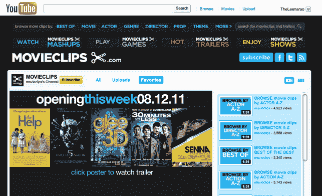

# 有了 700 万美元的新资金，Movieclips Lands 与 YouTube 达成协议，成为电影剪辑的 Vevo

> 原文：<https://web.archive.org/web/http://techcrunch.com/2011/08/09/armed-with-7m-in-new-funding-movieclips-lands-deal-with-youtube-to-be-the-vevo-of-film-clips/>

我们是在线电影剪辑网站[、Movieclips.com](https://web.archive.org/web/20230205141811/http://movieclips.com/)的忠实粉丝，T2 于 2009 年推出作为搜索引擎，从 20 世纪福克斯、米高梅、派拉蒙、索尼影业、环球影业和华纳兄弟影业的图书馆中检索出超过 2 万个不同的剪辑。今天，该公司宣布已经从 MK Capital(YouTube 上一家大型游戏出版商 Machinima 的创始投资者)领导的基金中为 T4 筹集了 700 万美元。沙斯塔风险投资公司、第一轮资本、里士满公园合作伙伴、杰夫·克拉维尔、海军拉维康德、杰夫·凯尔、汤姆·麦克尼尔尼、艾伦·德贝沃伊和戈登·鲁宾斯坦也参加了这一轮。但这还不是全部。电影剪辑公司宣布与 YouTube 达成一项利润丰厚的新的类似 Vevo 的协议，将该初创公司所有获得许可的好莱坞高清电影剪辑带到在线视频平台。

如您所知，随着电影公司的合作(这是电影内容许可之战的一半)，Movieclips 还开发了专有技术，为每个场景分配多达 1000 个数据点，使得按演员、电影名称、对话片段、情绪、导演、流派等查找场景变得非常容易。这些数据使人们能够通过精心策划的列表和游戏来搜索和发现电影。去年，初创公司[在纽约的 TechCrunch Disrupt 推出了一款新产品](https://web.archive.org/web/20230205141811/https://techcrunch.com/2010/05/25/movieclips-wants-to-drink-other-movie-clips-sites-milkshake-with-mashups/)，名为 Movieclips Mashups，它允许任何人制作两分钟剪辑的蒙太奇。

联合创始人扎克·詹姆斯告诉我(查看新闻中我们对詹姆斯的 TCTV 采访),目标是签署一份发行协议，将视频上传到 YouTube，这得到了电影公司的支持，因为电影公司对电影内容的保护是出了名的。尤其是在流量巨大的公共网站上，比如 YouTube。就像 Vevo 能够与唱片公司合作将音乐视频放在 YouTube 上一样，Movieclips 也在努力将电影和电影剪辑放在视频平台上。

但詹姆斯说，令人惊讶的是，大多数工作室都接受将视频片段上传到 YouTube 的想法。联合创始人 Rich Raddon 解释说:“工作室之间有一种前所未有的开放性。现在，YouTube 正在寻找优质内容合作伙伴，几年前可能会嘲笑我们的工作室实际上正在倾听。这都是关于正确的时机。”拉登说，迪士尼是唯一没有参与电影剪辑交易的主要工作室。

所以现在，电影剪辑将在 YouTube 上有许多专用频道(在这里找到),按演员、电影类型、流派、导演等细分剪辑。人们可以在观看 YouTube 的任何地方观看这些视频。该公司还将增加互动游戏、琐事挑战、剪辑混搭、预告片和可点击的视频格式。这些片段还将出现在 YouTube 视频点播平台上的电影临时演员中。

所有的视频都将包括某种形式的广告，无论是预卷还是其他形式。虽然 Movieclips 拒绝向我们透露这笔交易的确切收入份额，但我们知道初创公司将获得一部分收入，YouTube 将获得一部分收入，工作室将获得最大一部分收入。

YouTube 负责音乐、电影和节目的产品营销经理卡米尔·赫斯特(Camille Hearst)在谈到 Movieclips 交易时说，“多亏了 Movieclips.com，有大量的内容可以增加 YouTube 用户的电影体验……我们很高兴能与 Movieclips.com 合作，为用户提供他们想要的东西，让他们更多地了解 YouTube 上的电影。”

顺便提一下，詹姆斯告诉我们，他最初是在 2010 年 5 月 TechCrunch Disrupt 上向谷歌副总裁玛丽莎·梅耶尔提出这个想法的。显然，梅耶尔(和 YouTube)在听。

考虑到 Vevo 在 YouTube 交易后的成功，这对电影剪辑来说是一件大事。希望这家初创公司将从这笔交易中获得大笔现金，但就产生浏览量和品牌曝光率而言，分销平台本身非常有利可图。Vevo 每月的浏览量约为 10 亿次，并为[带来了数千万的收入。](https://web.archive.org/web/20230205141811/https://techcrunch.com/2010/09/29/vevo-is-seeing-tens-of-million-in-revenue/)

至于资金，詹姆斯说，新的资金将用于“双倍下注”YouTube 的机会。该公司还希望将电影剪辑整合到移动和社交平台中，包括脸书、Twitter 和 iPad(该网站还推出了一款专门的视频播放器和一款具有 API 功能的[,开发者可以用它来整合其他网站上的电影剪辑；AOL 的 Moviefone 实际上在其平台上使用了该技术)。](https://web.archive.org/web/20230205141811/https://techcrunch.com/2010/03/01/if-you-build-it-he-will-come-movieclips-now-available-internationally-releases-api/)

