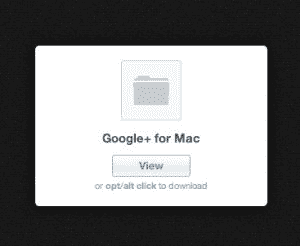
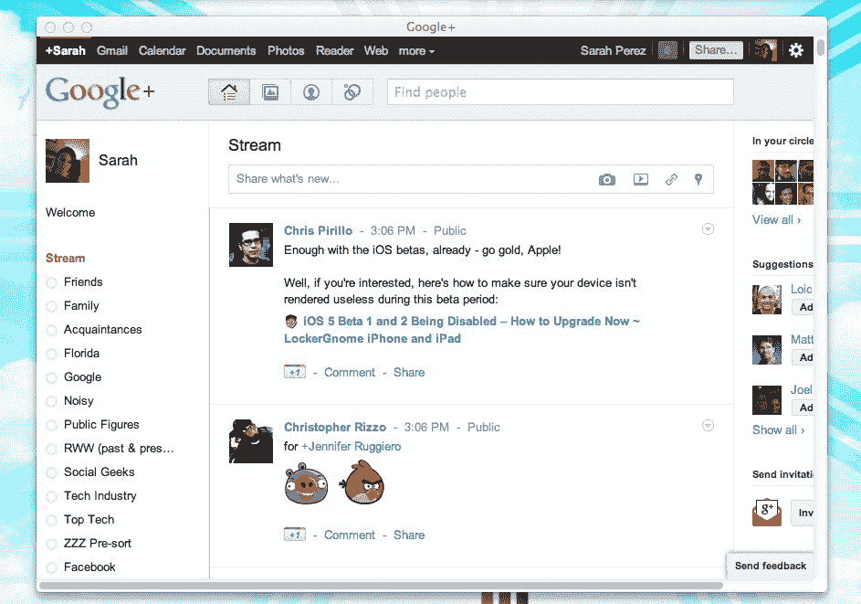

# Google+，苹果应用 TechCrunch

> 原文：<https://web.archive.org/web/https://techcrunch.com/2011/08/09/google-the-mac-app/>

科技实验室青少年创意总监、Sully Creative 创始人兼首席执行官 Sully Taylor 发布了一款面向 Mac 用户的 Google+应用。然而，这款应用非常简单。“只是一个移植的浏览器，”他说，“不是一个本地应用。”

是的，我们知道你可以使用 Fluid.app 来做几乎相同的事情——也就是说，如果你喜欢自己做这项工作的话。但泰勒表示，对于他下周计划用这款应用做的事情来说，Fluid 还不够强大。

*哦，真的吗？*

[的新应用](https://web.archive.org/web/20230204163355/http://c.sully.me/9AIW)(直接下载)需要谷歌 Chrome 和 Mac OS X，尽管少数用户报告在 Lion 上安装有问题。不管怎样，我在这里经营狮子，没有任何问题。

泰勒是 Google+开发者计划的成员，~~可以访问私有 API 的~~(见第二次更新，嗯)，但这个应用程序是使用 Web 界面构建的。

他还指出，这个应用程序只是一个临时的解决方案。他正致力于通过一个真正的本地应用程序将 Google+带到桌面上，同时也想要一些东西。

到目前为止，我在使用这款应用时发现的一个问题是，当你点击外部网站的链接时，你会卡在那里。没有办法点击“返回”返回 Google+。

我不得不承认，我不确定使用 app 是否有重大好处，但我很好奇 Taylor 接下来会用它做什么。

也就是说，如果你对 Google+ *(咳咳，咳咳)*有点着迷，把这款应用的图标放在你 Mac 的 dock 上是很有趣的，可以提醒你关注社交网络和那些无时不在、诱人的亮红色通知。

*谢谢，[路易·格雷](https://web.archive.org/web/20230204163355/https://plus.google.com/u/0/100535338638690515335/posts/fErMc2LFw8W)*

*更新于晚上 8:30，澄清 API 用法。*

*更新，周三上午 9:20。:嗯，这个有意思。谷歌要求泰勒删除 Google+上的评论，其中他表示自己可以访问私有 API。他们说他没有。泰勒还发邮件给我，让我知道他从个人资料中删除了“误导性评论”。*