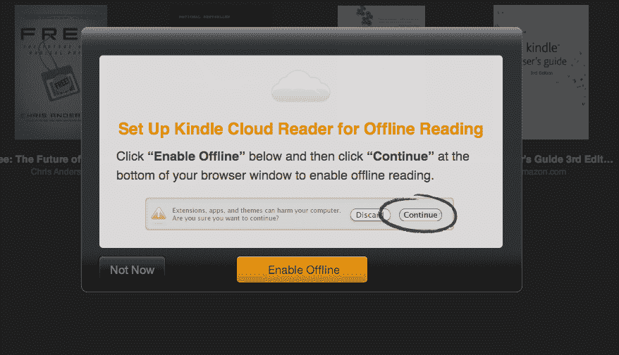
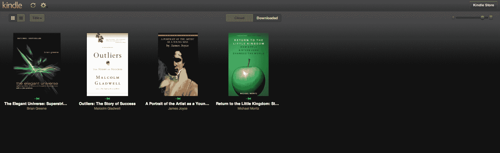
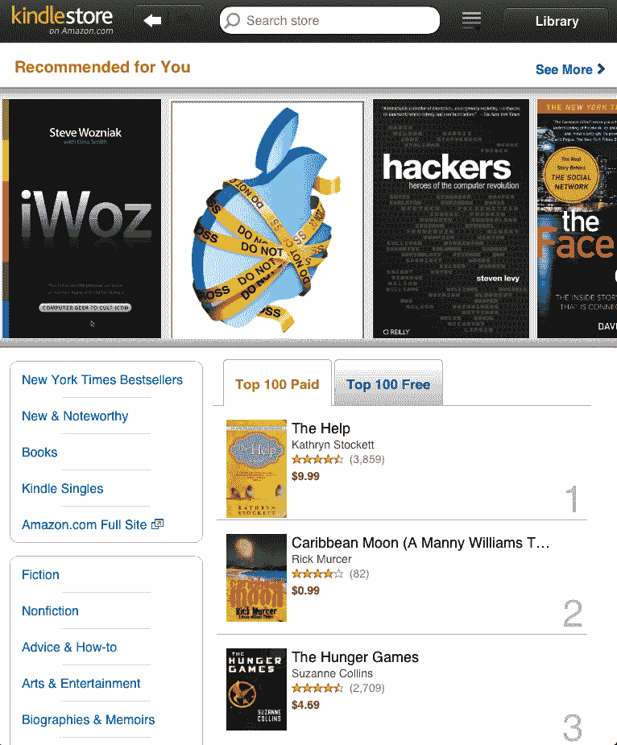
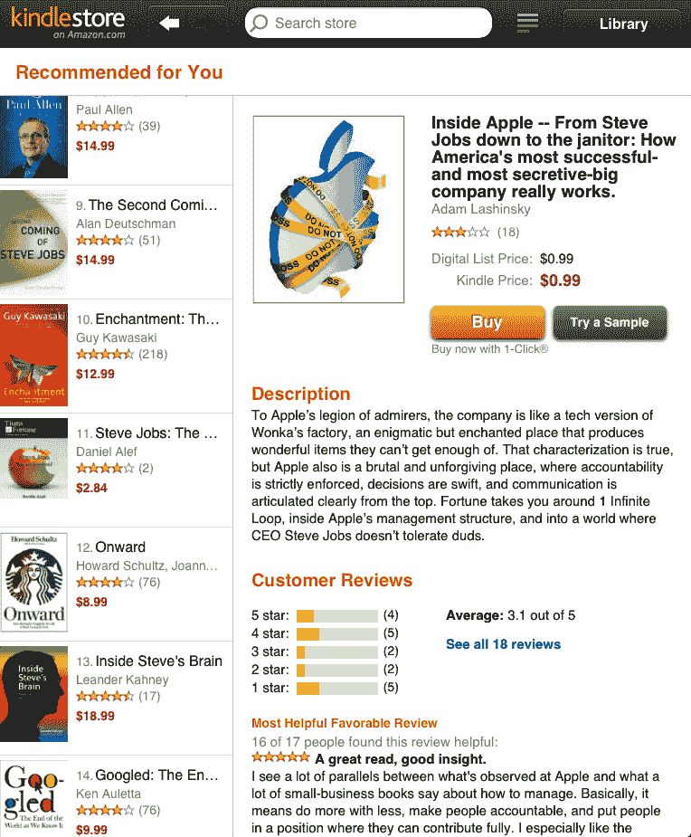

# 亚马逊回应苹果的条件:基于网络的 Kindle 云阅读器——在 PC 上很棒，在 iPad 上更好

> 原文：<https://web.archive.org/web/http://techcrunch.com/2011/08/09/kindle-cloud-reader/>

关于苹果最近对 iOS 条款的修改，已经有了很多报道。起初，每个人都确信许多大玩家[将被迫退出他们的应用](https://web.archive.org/web/20230404023601/https://techcrunch.com/2011/02/15/apple-in-app-subscriptions/)，比如亚马逊广受欢迎的 Kindle 应用。但是后来[苹果稍微放宽了规定](https://web.archive.org/web/20230404023601/https://techcrunch.com/2011/06/09/apple-backpedals-on-app-store-subscription-rules/)，并且简单地说亚马逊和其他[不能从他们的 iOS 应用](https://web.archive.org/web/20230404023601/https://techcrunch.com/2011/06/09/apple-defies-death-once-again/)链接到他们自己的商店。亚马逊答应了。但与此同时，他们也在研究另一种选择。

虽然亚马逊还没有对此发表任何言论，但是 [Kindle 云阅读器](https://web.archive.org/web/20230404023601/https://read.amazon.com/)已经上线。这是他们的 Kindle 电子书阅读器应用程序的网络版本。由于 HTML 5(或 Chrome 浏览器扩展)的魔力，它允许你从云中阅读书籍或下载书籍进行离线阅读。它看起来和工作都很棒。

亚马逊表示，该应用程序正式支持 Chrome 和 Safari。这意味着它可以在 PC、MAC、Linux 甚至 Chromebooks 上运行。这也意味着它可以在 iPad 上运行。事实上，亚马逊在他们的网站上大肆宣传。Kindle 云阅读器页面上的第三点是:

> 针对 iPad 优化:在 Kindle 商店购买平板电脑

同样，由于新的条款，这是你不能在 iOS 应用中做的事情。

然而，虽然 iPad 受支持，但 iPhone 目前不受支持。亚马逊建议你去看看他们免费的 Kindle 阅读器原生应用程序，以便在 iPhone 上阅读。我感觉 iPhone 的浏览器版本也在开发中。

iPad 版本尤其好，因为商店针对该设备进行了全面优化。您可以轻松地在商店和您自己的图书馆之间来回切换。感觉像是原生 app，其实不是。你甚至可以前后滑动来在页面之间移动(虽然有点慢)。

需要注意的一点是，Kindle 图书的云版本(显然还有下载版本)仍然仅限于一定数量的设备。因此，如果你把你的书下载到你的 Kindle、iPad、iPhone 等，你可能会超出限制，无法在云中阅读它们。

几周前，在苹果开始执行新的 iOS 条款后，一个电子书阅读器 Kobo 出来说他们将[开发一个网络应用来绕过限制](https://web.archive.org/web/20230404023601/http://www.wired.com/gadgetlab/2011/07/kobo-working-on-web-app-to-bypass-app-store-restrictions/)。但是，亚马逊和 Barnes & Noble 等其他公司仍然保持沉默，并改变了他们的应用程序，删除了他们商店的链接。事实证明，亚马逊也在悄悄地做着同样的事情。现在它已经准备好了。而且非常好。

**更新**:在我们昨晚的故事之后，亚马逊今天早上发布了一份关于这项服务的新闻稿。在下面找到它:

> Kindle 云阅读器简介
> 
> 在您的网络浏览器中阅读超过 950，000 本 Kindle 图书–无需下载或安装
> 
> 基于 HTML5，Kindle 云阅读器针对你正在使用的平台进行了优化，并自动将你的最新书籍存储在本地以供离线阅读
> 
> 即时书籍——无需等待下载，立即开始阅读书籍，无论是离线还是在线
> 
> 西雅图——2011 年 8 月 10 日——(纳斯达克股票代码:AMZN)——两年多来，亚马逊一直在提供各种免费的 Kindle 阅读应用，让客户能够“一次购买，随处阅读”客户已经可以在最受欢迎的设备和平台上阅读 Kindle 书籍，包括 Kindle、ipad、iPhones、iPod touches、PC、MAC、Android 手机和平板电脑以及黑莓。今天，Amazon.com 宣布了 Kindle Cloud Reader，这是其最新的 Kindle 阅读应用程序，利用 HTML5，客户可以只使用他们的网络浏览器即时阅读 Kindle 书籍，无论是在线还是离线，无需下载或安装。与所有 Kindle 应用程序一样，Kindle Cloud Reader 会自动同步您的 Kindle 图书馆，以及您所有 Kindle 书籍的最后一页阅读内容、书签、笔记和高亮显示，无论您选择如何阅读它们。Kindle 云阅读器及其集成的触摸优化 Kindle 商店从今天开始在 iPad 上的 Safari、桌面上的 Safari 和 www.amazon.com/cloudreader.的 Chrome 上可用
> 
> 亚马逊 Kindle 总监 Dorothy Nicholls 表示:“我们很高兴能够在‘一次购买，随处阅读’的使命中向前迈出一大步，帮助客户从任何地方即时访问他们的图书馆。“我们用 HTML5 从头开始编写应用程序，因此客户也可以直接从浏览器离线访问他们的内容。HTML5 的灵活性使我们能够构建一个能够自动适应您所使用的平台(从 Chrome 到 iOS)的应用程序。为了轻松无缝地发现新书，我们在云阅读器中直接添加了一个集成的触摸优化商店，允许客户一键访问大量书籍。”
> 
> Kindle 云阅读器的功能包括:
> –沉浸式查看您的整个 Kindle 图书馆， 通过即时访问您的所有书籍
> –在您的浏览器中立即开始阅读超过 950，000 本 Kindle 书籍
> –针对您的网络浏览器优化的嵌入式 Kindle 商店可以无缝地发现新书并立即开始阅读它们
> –新的 iPad Kindle 商店完全针对 iPad 的触摸界面构建
> –您当前的书籍自动可供离线使用。 您还可以选择保存一本书以便随时离线阅读
> –接收自动软件更新，无需下载新软件
> –选择任何一本书开始阅读，根据您想要的字体大小、文本颜色、背景颜色等自定义页面布局
> –查看您在其他 Kindle 应用程序或 Kindle 应用程序上制作的所有注释、高亮显示和书签
> –在您的 Kindle 和免费 Kindle 应用程序之间同步您最后一次阅读的页面，以便您可以随时从上次离开的地方继续阅读
> 
> Kindle 云阅读器从今天开始可以在 iPad 上的 Safari、桌面上的 Safari 和 Chrome 上使用。iPad 上的 Kindle 云阅读器针对 iPad 的尺寸和独特的触摸界面进行了优化。甚至不用离开应用程序，客户就可以在 Kindle 商店开始购物，并将找到专为 iPad 的 Safari 浏览器构建的独特和沉浸式购物体验。
> 
> 未来几个月，Kindle Cloud Reader 将在其他网络浏览器上推出，包括 Internet Explorer、Firefox、BlackBerry PlayBook 浏览器和其他移动浏览器。
> 
> Amazon.com 用户可以在 www.amazon.com/cloudreader.使用 Kindle 云阅读器立即开始阅读他们的 Kindle 书籍