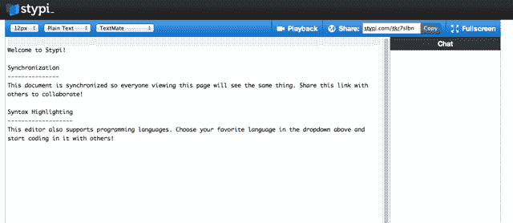

# YC 资助的 Stypi 是 Etherpad 重生 TechCrunch

> 原文：<https://web.archive.org/web/https://techcrunch.com/2011/08/09/yc-funded-stypi-is-etherpad-reborn/>

Etherpad 的粉丝们，兴奋起来吧——一家由 Y Combinator 支持的名为 [Stypi](https://web.archive.org/web/20230131012814/http://www.stypi.com/) 的初创公司已经开发了一款几乎相同的产品，并于今天发布。

首先，回顾一下历史:早在 2008 年，我们第一次[报道了](https://web.archive.org/web/20230131012814/https://techcrunch.com/2009/07/23/etherpad-gets-a-makeover-and-becomes-even-more-of-a-threat-to-google-docs/)一款来自 YC alum AppJet 的漂亮的实时文档编辑器，名为 Etherpad。文本编辑器允许多人同时编辑同一个文档，所有的编辑都实时显示给查看文档的其他人。它很轻便，很容易与合作者分享——而且[非常好](https://web.archive.org/web/20230131012814/https://techcrunch.com/2009/07/23/etherpad-gets-a-makeover-and-becomes-even-more-of-a-threat-to-google-docs/),它可能会对谷歌文档构成潜在威胁。这就是为什么当谷歌在 2009 年 12 月收购该公司时并不令人惊讶。该应用程序最终被开源，因为团队开始致力于命运多舛的 Google Wave，而 Etherpad 的服务器被关闭。

但是 Stypi 认为轻量级实时协作文本编辑器仍然有市场。所以他们从头开始建立了一个新的(他们没有使用任何 Etherpad 的代码)。

Stypi 使用起来非常简单。前往 Stypi.com，你会立即被推进一份新文件。您可以像编辑任何其他文档一样编辑它，并且您可以通过向他们发送 URL 来邀请新的合作者(没有权限系统，您只需要单击链接，您就可以立即看到该文档)。

该编辑器包括回放模式等关键功能，可以让您一个字符一个字符地回顾文档是如何形成的。右边栏有实时聊天。而且，由于 Etherpad 的一个常见用例是程序员在代码上进行协作，Stypi 已经集成了对一些程序员友好特性的支持，比如语法突出显示。我唯一的不满是:只要你输入每个字符，聊天框就会显示给你的合作者(就像 Wave 一样)，这让我一直感到不快。

当然，Google Docs 现在提供了实时文本编辑功能，那么为什么有人会使用 Stypi 呢？联合创始人陈以桐说，Stypi 非常轻量级的事实是一个很大的区别(我同意这一点)，谷歌文档不是为编辑代码而优化的。

接下来 Stypi 有一些更雄心勃勃的计划:它想让像 Photoshop 这样的本地应用程序在多个用户之间同步修改。该公司已经为流行的文本编辑器 Vim 开发了一个插件，可以做到这一点。陈说，他们已经奠定了基础，让其他应用程序也可以使用一个小的“助手”应用程序进行同步，该应用程序目前为 Mac 开发，并将在其他平台上提供。

