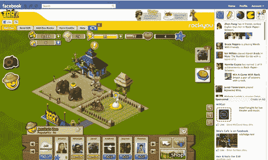

# 脸书修改了应用程序画布页面，包括游戏更新和全屏选项 TechCrunch

> 原文：<https://web.archive.org/web/http://techcrunch.com/2011/08/11/facebook-revamps-app-canvas-page-includes-ticker-for-game-updates/>

# 脸书改版应用画布页，包括游戏更新和全屏选项的 Ticker

脸书刚刚透露了今天与[游戏相关的](https://web.archive.org/web/20230203045221/https://developers.facebook.com/blog/post/538/)公告:一个更精简、更具参与性的应用画布页面，包括一个游戏更新的滚动条(见下文)。对于那些没有意识到的人来说，画布页是应用程序在脸书占据的“空白画布”。

《脸书月刊》的 7.5 亿用户中有 200 人玩游戏，游戏无疑是这个社交网络的核心优势之一，设计调整是让用户着迷的关键一步。随着今天早些时候 Google+游戏的推出，游戏领域将成为任何关注社交网站的人的战场。

针对所有用户的更改现在包括画布页面右上角的游戏滚动条，用户可以在这里选择接收朋友的游戏相关故事的更新，如高分和成就。脸书说，用户可以通过调整他们的设置来控制他们看到什么样的故事。

脸书还决定让所有开发者选择“流体画布”或增加画布页面上的房地产，以便更好地适应用户的浏览器——像 Cityville、Monster World、Mystery Manor 和其他游戏已经实现了一个更大的游戏场。此外，用户现在可以在画布页和脸书主页上为他们喜欢的游戏添加书签。

虽然脸书早些时候给我们发了一份简报，强调了小型游戏发行商在准备此次发布时取得的成就，但这些变化似乎适用于任何在脸书运行应用的人，而不仅仅是游戏开发商。也许长尾理论和向小开发商承诺更多向用户推销他们自己的方法是有好处的？据脸书称，其排名前 80 的游戏每月至少有 100 万活跃用户。

