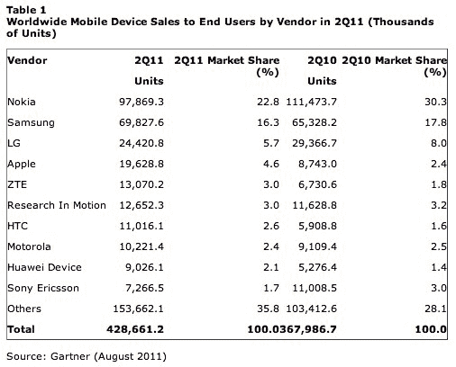

# Gartner: Android 操作系统销量超过 iOS、RIM 和诺基亚 TechCrunch

> 原文：<https://web.archive.org/web/http://techcrunch.com/2011/08/11/gartner-android-os-sales-top-ios-rim-and-nokia/>

Gartner 刚刚发布了 2011 年 Q2 的新移动设备销售，并报告称谷歌和苹果是智能手机生态系统中的“明显赢家”。今年第二季度，iOS 和 Android 的总份额翻了一番，接近 62%，高于去年同期略高于 31%的水平。

谷歌的移动操作系统现在占智能手机总销量的 43.4%，高于 2010 年 Q2 的 17.2%。而苹果达到了 18.2%，高于同期的 14.1%。

然而，Symbian 现在占 22.1%，低于 40.9%。

实际上，诺基亚和 RIM 都受到了影响，诺基亚在渠道中的销量下降，原因是对 Symbian 的需求减少，以及欧洲和中国的库存管理问题。与此同时，RIM 在 Q2 智能手机市场的份额从一年前的 19%降至 12%。

据该分析公司称，全球移动设备销量较去年同期增长 16.5%，达到 4.287 亿部。2011 年，智能手机销量同比增长 74%，占 Q2 整体销量的 25%，高于 2010 年 Q2 的 17%。

Gartner 首席研究分析师罗伯塔·科扎(Roberta Cozza)表示:“智能手机销量持续上升，功能手机销量下降。她指出，在成熟市场，人们选择 Android 而不是功能手机，部分原因是制造商和运营商的促销。

**按供应商**

【T2

从厂商的手机销量来看，诺基亚仍高居榜首，占整体手机市场的 22.8%。但下一季度，诺基亚的份额可能会下降。“渠道的销售努力，加上诺基亚对零售和分销商销售的更大关注，使诺基亚的总库存减少了 900 多万部，智能手机减少了 500 万部，帮助其保持了智能手机销量领先制造商的地位，”科扎指出然而，我们将不会在 2011 年第三季度看到这种表现的重演，因为诺基亚的渠道相当贫乏。"

三星实现了增长，这在一定程度上要归功于新的 Galaxy S II，该产品销售良好——截至 7 月底，销量为 500 万部。然而，高德纳表示，其整体份额同比下降，季度环比仅略有增长。

RIM 的智能手机市场份额从一年前的 19%下降到 12%，在整体移动设备排名中的第五位也被中兴通讯取代。Gartner 认为，RIM 在试图从黑莓 7 过渡到 QNX 的过程中，也将面临一些困难。

高德纳表示，苹果继续“超出预期”，尽管 iPhone 4 即将被更新的机型取代。它的部分增长来自上个季度进入的 15 个新国家的 42 家新运营商，使其国家总数达到 100 个。截至 Q2 年底，面向最终用户的销量达到 1960 万台。在中国，苹果是第七大手机厂商，第三大智能手机厂商。