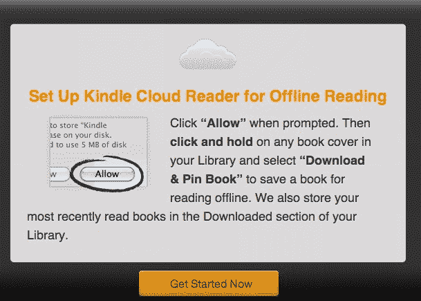
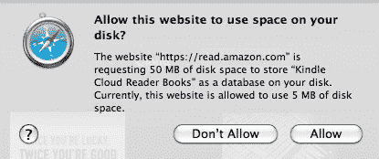

# 是时候反思世界上的每一个网站了 TechCrunch

> 原文：<https://web.archive.org/web/http://techcrunch.com/2011/08/11/time-to-rethink-every-website-in-the-world/?utm_source=feedburner&utm_medium=feed&utm_campaign=Feed:+Techcrunch+(TechCrunch>&utm_content=Google+Reader)

# 是时候反思世界上的每一个网站了

我试用了 [Kindle 云阅读器](https://web.archive.org/web/20230205040024/https://read.amazon.com/ "Kindle Cloud Reader")和神圣的狗屎，我觉得马赛克刚刚被发明出来，现在我们有了<图像>标签。(现在我们的一些读者甚至知道什么是[马赛克](https://web.archive.org/web/20230205040024/http://en.wikipedia.org/wiki/Mosaic_(web_browser))？嗯，那时候真的很酷。甚至是革命性的。)

或者说，有人最终发现了如何使用图像标签。HTML 5 已经推出一段时间了，但其他人似乎都在开车睡觉。

本周早些时候 [MG Siegler](https://web.archive.org/web/20230205040024/https://techcrunch.com/author/mg-siegler/) 写了一篇关于亚马逊新阅读器的[帖子](https://web.archive.org/web/20230205040024/https://techcrunch.com/2011/08/09/kindle-cloud-reader/)，但是他没有指出这对我们所有人来说是一个多么惊人的技术进步。对我来说，它在我的 iPad 上看起来很棒并不重要。最酷的部分是，它离线工作很漂亮。

Gmail 和其他几个网站的离线模式很糟糕，但它们远没有亚马逊的酷。(例如，Gmail 甚至没有离线发件箱。)亚马逊所建立的是对我们互联网未来的一瞥，这将改变一切。

自己试试:点击俏皮的弹出窗口后，开始在云阅读器上阅读一本书(见下文)。现在离线，重启 Safari，进入[https://read.amazon.com](https://web.archive.org/web/20230205040024/https://read.amazon.com/)，毫无疑问，在没有任何连接的情况下，你将能够从你离开的地方取回你的书。当你尝试这样做时，世界上所有其他网站，甚至 Gmail，都会抛出一个难看的错误。

想象一下一个再也看不到最喜欢的网站上的“无连接”页面的世界。我不得不相信程序员的失业率将会更低。