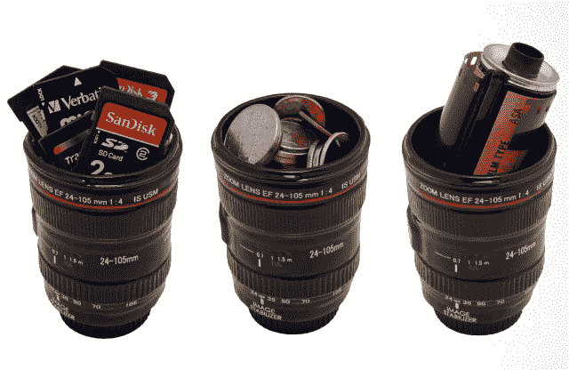

# 佳能镜头拍摄眼镜，用于饮酒和拍摄

> 原文：<https://web.archive.org/web/http://techcrunch.com/2011/08/12/canon-lens-shot-glasses-for-drinkin-and-shootin/>

# 佳能镜头拍摄眼镜，用于饮酒和拍摄

镜头相关的蜉蝣似乎是我的软肋。[佳能保温杯](https://web.archive.org/web/20230203121122/https://techcrunch.com/2010/03/03/canon-weather-sealed-70-200mm-l-coffee-thermos/)、[佳能保温杯](https://web.archive.org/web/20230203121122/https://techcrunch.com/2010/08/24/another-canon-lens-mug-want-so-bad/)、[尼康保温杯](https://web.archive.org/web/20230203121122/https://techcrunch.com/2010/07/27/replica-nikon-lens-mug-now-available/)、[尼康手环](https://web.archive.org/web/20230203121122/https://techcrunch.com/2011/03/01/f-stop-bracelets-for-the-stylish-photographer-in-your-life/)——乐趣永不停止。或者，如果你是宾得的用户，它永远不会启动。你所得到的是很棒的相机和令人惊叹的镜头选择。

对于喜欢偶尔喝点酒，或者只是喜欢看起来像镜头的东西的摄影师来说，可以考虑这些 24-105 毫米变焦镜头眼镜。我不能保证图像稳定，但你不能责怪他们的大小。

它们的容量是 1.5 盎司(即一个普通的子弹杯)，由坚固的釉面陶瓷制成，[在 Photojojo](https://web.archive.org/web/20230203121122/http://photojojo.com/store/awesomeness/lens-shot-glass/) 一套三个售价 18 美元。

[通过[按钮](https://web.archive.org/web/20230203121122/http://www.ohgizmo.com/2011/08/12/shot-glass-lens-set/)