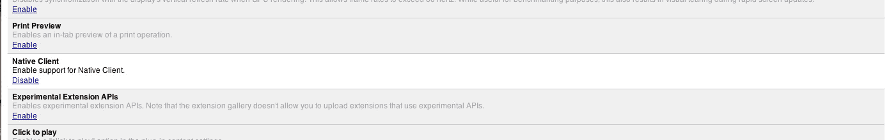

# 周五浪费时间:在你的 Chrome 浏览器上玩 DOS 游戏

> 原文：<https://web.archive.org/web/https://techcrunch.com/2011/08/12/friday-time-waster-play-dos-games-in-your-chrome-browser/>

# 周五浪费时间:在你的 Chrome 浏览器上玩 DOS 游戏

[NaClBox](https://web.archive.org/web/20230204213937/http://www.naclbox.com/) (懂了？)是 [DOSBox](https://web.archive.org/web/20230204213937/http://www.dosbox.com/) 的一个端口，可以让 DOS 游戏直接在你的浏览器上玩。现在你可以玩像[《星球大战:Tie Fighter](https://web.archive.org/web/20230204213937/http://www.naclbox.com/gallery/star-wars-tie-fighter) 这样配有多声部 MIDI 音效和热辣 VGA 图形的游戏。它可以在 MAC、PC 和 Linux 机器上运行，并在 Chrome 13 下运行。

要玩游戏，你必须打开 Chrome 原生客户端(Na Cl，因此有双关语):

> 在 Chrome 地址栏中，键入:
> 
> 关于:标志
> 
> 找到标题为“Native Client”的部分
> 
> 点击“启用”，重启 Chrome。

游戏下载完毕，稍后您就可以开始玩了。最有趣的是，这可能是 ChromeOS 下玩游戏的方式——就在浏览器中，几乎没有延迟。如果这比 Steam 之类的服务更好或更差，我不愿意争论，但它确实指出了操作系统即将推出的一些非常有趣的功能。

该网站已经存在了一段时间，但他们增加了一些新游戏，我怀疑我只是用这个令人愉快的 [Hackernews](https://web.archive.org/web/20230204213937/http://news.ycombinator.com/) 发现做了几天。

[项目页面](https://web.archive.org/web/20230204213937/http://www.naclbox.com/gallery)