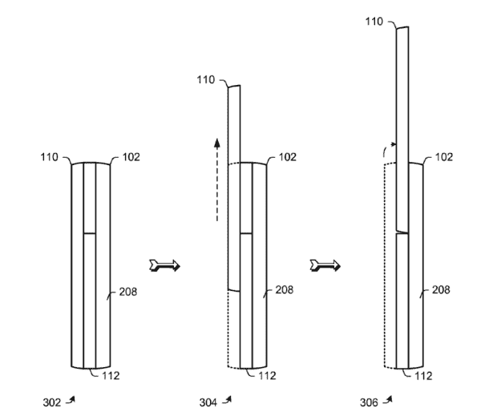
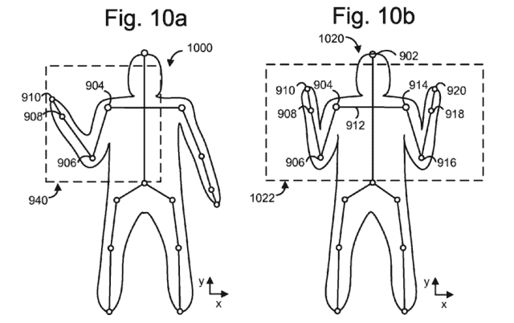
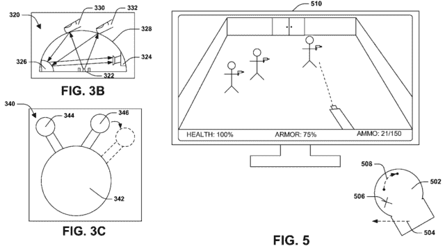

# 微软专利平板滑盖手机外形、多点触控游戏鼠标 TechCrunch

> 原文：<https://web.archive.org/web/http://techcrunch.com/2011/08/12/microsoft-patents-flat-slider-phone-form-factor-multi-touch-gaming-mice/>

# 微软专利平板滑盖手机外形、多点触控游戏鼠标

在过去的几天里，我们看到了许多来自苹果的有趣的专利，但微软也喜欢申请专利——他们刚刚获得了一个特殊滑块格式的手机设计包，以及一些 Kinect 和鼠标技术。

当然，他们不会为一个普通的滑块申请专利。他们正在申请一些滑动机构的专利，一旦你完成滑动动作，键盘和屏幕就“位于基本相似的平面上”也就是说，大多是同花顺。看看这个:

【T2

潜在的好处是，更舒适的打字体验。许多人抱怨不得不在 G1 的“下巴”周围打字，其他键盘凹陷的手机也有类似的问题。我对这种设计的问题是，额外的铰链等可能会增加重量，降低手机的坚固性。不过，第二种设计看起来更有趣，降低显示屏而不是升高键盘。这可能真的有用。

我想看到的是滑动键盘的一些专利，这种键盘的按键实际上很有趣。或者是平板电脑的滑出式键盘，不会增加 500%的重量。

微软还获得了一项专利，该专利显然与 [Kinect](https://web.archive.org/web/20230203063943/https://techcrunch.com/tag/kinect/) 有关——它是关于[确定手势的潜在空间](https://web.archive.org/web/20230203063943/http://appft.uspto.gov/netacgi/nph-Parser?Sect1=PTO1&Sect2=HITOFF&d=PG01&p=1&u=%2Fnetahtml%2FPTO%2Fsrchnum.html&r=1&f=G&l=50&s1=%2220110193939%22.PGNR.&OS=DN/20110193939&RS=DN/20110193939)并跟踪用户在一种圆锥内的运动。我不会说这是特别令人兴奋的，但如果你对 Kinect 和微软的实现感兴趣，这可能会成为这个周末的一些有趣的阅读。

更合我胃口的是，微软已经申请了[专利，这是一种通过多点触控鼠标](https://web.archive.org/web/20230203063943/http://appft.uspto.gov/netacgi/nph-Parser?Sect1=PTO1&Sect2=HITOFF&d=PG01&p=1&u=%2Fnetahtml%2FPTO%2Fsrchnum.html&r=1&f=G&l=50&s1=%2220110195781%22.PGNR.&OS=DN/20110195781&RS=DN/20110195781)与游戏互动的方法。我很惊讶这个专利会飞起来，因为游戏只是软件的一种形式，关于软件和多点触摸表面的交互，肯定有数百个专利在发挥作用。我主要喜欢看专利，因为他们使用的插图让人回想起过去的日子，那时[多点触控鼠标](https://web.archive.org/web/20230203063943/https://techcrunch.com/2009/10/05/microsofts-insane-new-multi-touch-mice-demoed-on-video/)还是一个新奇的命题。

[通过 [WMPoweruser](https://web.archive.org/web/20230203063943/http://wmpoweruser.com/microsoft-awarded-with-patent-for-sliding-mobile-device-wait-what/)