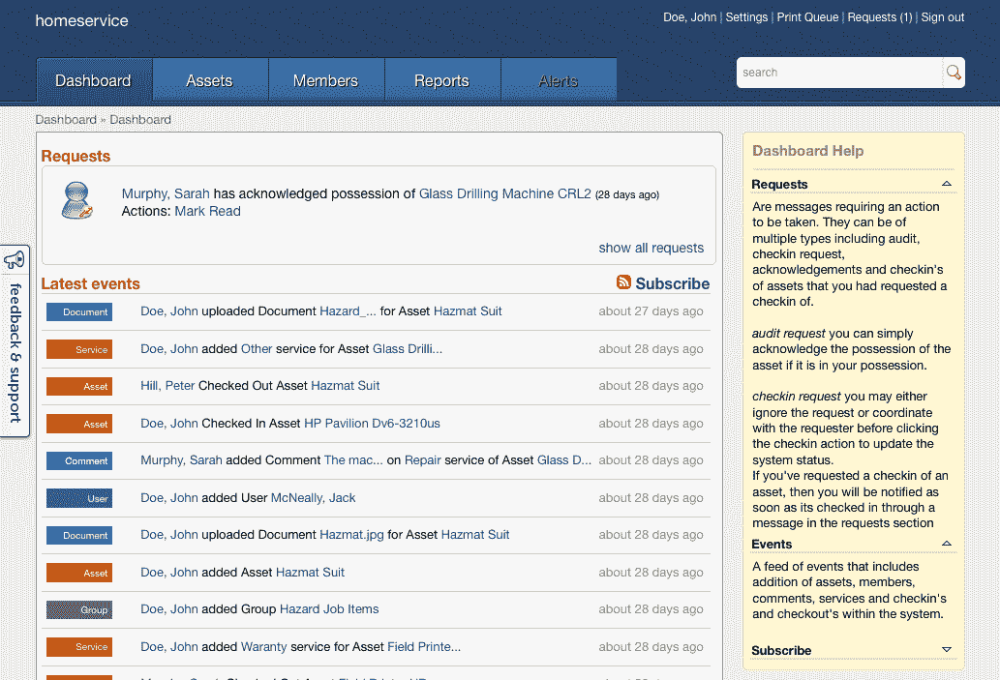

# EZOfficeInventory 让中小型企业能够轻松跟踪和管理公司资产(在云端)

> 原文：<https://web.archive.org/web/http://techcrunch.com/2011/08/13/ezofficeinventory-lets-smbs-easily-track-and-manage-company-assets-in-the-cloud/>

办公室库存管理系统:肯定不完全是世界上最性感的软件。然而，如果没有库存和资产管理系统，许多企业可能会以类似于 DMV 的速度工作。目前，中小型企业在选择跟踪办公室资产和库存的软件系统时，并不缺少工具可供选择；然而，这些选项中的大多数都涉及到不知疲倦地使用 Excel 或使用某种桌面产品，例如 [TurboSystems](https://web.archive.org/web/20230205024925/http://turbosystems.com/) 、[数据村](https://web.archive.org/web/20230205024925/http://www.datavillage.com/OfficeInventory.htm)或 [FoxFales](https://web.archive.org/web/20230205024925/http://www.foxfales.com/inventorypro.html) 等等。但是，如果一家公司有几十名员工，Excel 和桌面解决方案可能会让人头疼。

Sun Microsystems 的前员工 Syed Ali(在该公司被 Oracle 收购之前)和他的 IT 和软件极客团队表示，他们已经厌倦了在当今的跟踪解决方案中反复处理过时和不正确的办公室库存。Syed 说，他和他的团队共同与许多不同的公司合作，例如，事实上保留了办公室资产的列表，但与谁拥有什么相关的特定信息(如跟踪退房记录)经常完全丢失或更糟的是过时了——更不用说放错地方的资产经常被分配给错误的员工，这些员工可能甚至不再在该公司工作了。

可以想象，问题很多。为了帮助解决这些问题，Syed 和他的团队今天推出了 [EZOfficeInventory](https://web.archive.org/web/20230205024925/http://www.ezofficeinventory.com/) ，这是一个位于 SaaS 的解决方案，它通过委托模式以非传统方式进行资产管理，在这种模式下，库存跟踪的责任由员工分担，从而减少了管理员的工作量。

该解决方案支持通过员工的签出和签入机制以及管理员的活动新闻源轻松跟踪汇集的办公资产，允许他们仅在需要时查看和管理。员工还可以确定完成工作所需的可用资产，并可以即时访问手册和驱动程序。

由于 EZOfficeInventory 位于云中，该解决方案采用二维码作为资产标签，因此，通过在二维码中嵌入资产的唯一 URL，员工可以快速参考资产详细信息，并在丢失东西时识别合法所有者。员工可以通过安装了二维码阅读器和网络接入的 iPhone 或 Android 设备进行快速扫描。

该解决方案还可以最大限度地减少审计工作，因为管理员只需点击几下鼠标，就可以向员工索取资产照片或其他自定义工作流。EZOffice 还允许管理员查看使用报告，跟踪签出和签入，总拥有成本，甚至公司资产的服务历史。

公司还可以更改其解决方案中的安全设置，以便与现有工作流兼容，并在必要时添加更多隐私功能。

一些读者可能会发现下面的新闻图片会让人想起[base camp](https://web.archive.org/web/20230205024925/http://basecamphq.com/)(37 signals 发布的知名产品，也是 David Heinemeier Hansson 的公司，他是 Ruby on Rails 的创始人)。EZOfficeInventory 也是用 Ruby on Rails 实现的，正如 Syed 所说，他是 web 开发框架的“狂热粉丝”。

EZOfficeInventory 为其云应用提供为期两个月的免费试用，两个以上用户的套餐起价为每月 29 美元。

目前，资产管理系统仍处于非常早期的阶段(初创公司在这一点上是自举的)，网站的设计和用户界面(以及名称)还有很多工作要做，但软件本身正在解决许多中小型企业的一个重要痛点。

尽管将资产管理的责任交给员工(当然，还有一个制衡体系)很可能会提高效率和员工之间的信任，但这是有风险的。但是 Syed 说这是“将企业与 web 开发相结合的乐趣的一部分”,也是使用 web 技术解决企业级问题的过程。这是对现状的一次尝试，这位首席执行官认为，尽管有风险，但值得一试。

更多关于 EZOfficeInventory 的信息，点击[这里](https://web.archive.org/web/20230205024925/http://www.ezofficeinventory.com/)。

