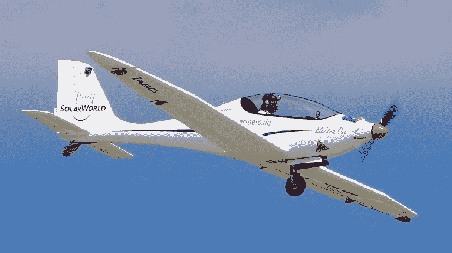
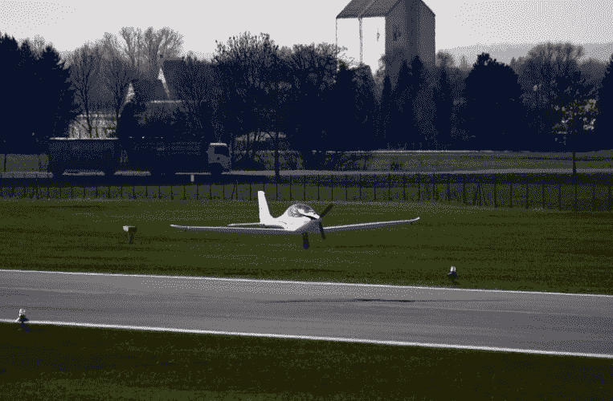

# 这架电动飞机由太阳能飞机库 TechCrunch 提供动力

> 原文：<https://web.archive.org/web/http://techcrunch.com/2011/08/14/this-electric-plane-is-powered-by-its-own-by-solar-hangar/>

# 这架电动飞机由太阳能飞机库提供动力

对绿色飞行感兴趣的航空爱好者可能会把埃莱克特拉一号飞机列入他们的愿望清单。PC-Aero 的电动飞机一次充电可以飞行长达三个小时，巡航速度为 100 英里/小时。充电发生在太阳能飞机库内，该飞机的预计购买价格为 14.5 万美元。

该飞机去年春天成功完成了首次飞行，并将于明年年中上市销售，等待在德国获得新的超轻型飞机认证。它最近因航空创新获得了[林德伯格电动飞机奖](https://web.archive.org/web/20230204220219/http://lindberghprize.org/)。

为了最大限度地提高效率，该飞行器由一种轻质纤维复合材料制成。加上电池，这架飞机重约 440 磅，整个飞机由一台 13.4 千瓦(17.96 马力)的发动机驱动。

然而，不要指望邀请朋友登机:飞机只能坐一个人，最大货物重量(包括飞行员)是 220 磅。

埃莱克特拉一号不仅减少了空气污染，还减少了噪音污染:它的工程师说，这种飞机产生的噪音是普通飞机的五分之一，是普通超轻型飞机的一半。

在这里观看飞机的行动:
【YouTube http://www.youtube.com/watch?v=N1Xm_ii6pSE?rel=0&w = 640&h = 390】