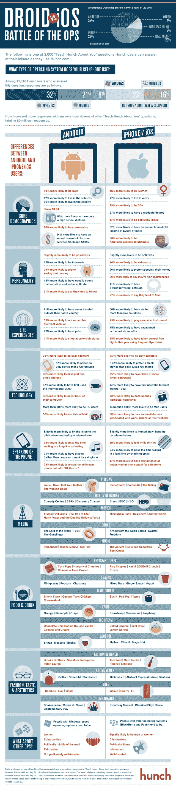

# 机器人是给廉价的悲观主义者的，iPhones 是给世俗的乐观主义者的

> 原文：<https://web.archive.org/web/http://techcrunch.com/2011/08/15/androids-pessimists-iphones-optimists/>

# 机器人是给廉价的悲观主义者的，iPhones 是给世俗的乐观主义者的

有没有想过 Android 和 iPhone 用户的真正区别是什么？根据预感，安卓用户中男性的比例要高 10%，倾向于年轻人，政治上保守的比例要高 20%。从下面的信息图可以看出，他们收入不错，但 iPhone 用户往往家庭收入更高。Android 用户也“稍微更可能是悲观主义者”，内向的人，并且有 29%更可能想要存钱。

iPhone 用户更可能是乐观主义者、外向者，并且自认“难伺候”。他们有 26%的可能喜欢花钱买闪亮的东西。他们认为自己是领导者的可能性比认为自己是追随者的可能性高 27 %,认为自己是早期采纳者的可能性高 50%。相比之下，Android 用户有 31%的可能成为后来的采用者，并且“有 57%的可能更喜欢功能齐全的丑陋设备。”安卓用户拥有个人电脑的几率也比苹果电脑高得多。只是说说而已。

Hunch 是如何知道所有这些相关性的？这些数据是基于 15818 名 Hunch 用户回答的问题:“你的手机使用什么类型的操作系统？”Hunch 用户中的细分是 32%的苹果和 21%的安卓，这与更主流的市场统计数据相反，例如尼尔森的数据显示，安卓智能手机在美国的市场份额为[39%](https://web.archive.org/web/20230204234003/http://www.engadget.com/2011/07/28/nielsen-android-leads-us-smartphone-market-with-39-percent-shar/), iPhone 为 28 %,但样本量应该足够大，可以得出一些关于安卓和 iPhone 用户的结论。(或者至少是凭直觉回答问题的人)。

根据相同的人如何回答 8000 万个其他问题，Hunch 数据还声称了解 Android 和 iPhone 用户的什么情况？嗯，拥有安卓系统的人有 12%的可能会养宠物，71%的可能从来没有出过国。这使他们成为居家者了吗？iPhone 用户在过去一年中出国旅行并使用了一些飞行常客里程的可能性要大得多。他们选择的早餐麦片更可能是 Crispix 或 Kashi GOLEAN Crunch，而不是玉米棒。他们对寿司比对牛排更感兴趣。

请记住，这些特征是基于概率的，不会对每个 iPhone 或 Android 用户都适用。例如，我宁愿吃牛排而不是寿司，猜猜我最常用的手机是哪种。众所周知，如果它出现在信息图中，那它一定是真实的。

