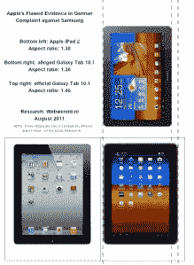

# 苹果在欧洲 Galaxy Tab 禁令中的证据严重误导...假的 TechCrunch

> 原文：<https://web.archive.org/web/https://techcrunch.com/2011/08/15/apples-evidence-in-european-galaxy-tab-injunction-was-seriously-misleading-as-in-false/>

# 苹果在欧洲 Galaxy Tab 禁令中的证据是严重误导的……就像假的一样

上周，苹果和三星的专利之争出现了严重的转折，苹果赢得了初步禁令，禁止在除荷兰以外的整个欧盟销售 Galaxy Tab 10.1。正如我们所提到的，[三星](https://web.archive.org/web/20230205011137/https://techcrunch.com/tag/samsung)在禁令发布之前并不知道发生了什么，这是德国法院系统的标准程序。如果这家总部位于韩国的公司知道的话，他们可能会提到[苹果](https://web.archive.org/web/20230205011137/https://techcrunch.com/tag/apple)用来获得进口禁令的证据(见左图)存在严重缺陷。

根据荷兰 IDG 出版物 [Webwereld.nl](https://web.archive.org/web/20230205011137/http://webwereld.nl/nieuws/107599/apple-levert-onjuist-bewijs-in-zaak-tegen-samsung.html) 的报道，用于 iPad 2 和 GalTab 10.1 之间并排比较的图片要么是错误的，要么是被操纵的。在苹果提交的文件第 28 页上， [Galaxy Tab 10.1](https://web.archive.org/web/20230205011137/https://techcrunch.com/tag/galaxy/) 的图像已经被裁剪，图像比例也被篡改。三星的平板电脑尺寸为 10.1 英寸 x 6.9in 英寸 x 0.34inin 英寸，而 iPad 2 的尺寸为 9.5 英寸 x 7.31in 英寸 x 0.34 英寸。

 所以如果你并排看平板电脑(都是纵向的)，你会注意到 [iPad 2](https://web.archive.org/web/20230205011137/https://techcrunch.com/tag/ipad) 从一边到另一边有点宽，但长度较短。根据指定的尺寸，GalTab 的长宽比为 1.46。在苹果的证据图像中，长宽比为 1.36(比应有的宽度宽 8%)，这使得 Galaxy Tab 10.1 的“整体外观”看起来与 iPad 2“几乎相同”(iPad 2 的长宽比为 1.30)。这正是苹果在诉状中使用的语言——同样在第 28 页。

最近，我们已经看到了相当多的[律师搞砸](https://web.archive.org/web/20230205011137/https://techcrunch.com/2011/08/12/leaked-fcc-doc-reveals-details-of-atts-strategy-for-t-mobile-deal/)的事情，但这相当可疑，不是吗？目前对 GalTab 的进口禁令完全与设计有关，所以法院确实是通过封面来判断这些书的。至少可以说，出示虚假展示产品外观的证据——尤其是当整个禁令完全基于硬件/设计时——是非常可疑的。让我们补充一个事实，苹果在出示证据时与法官有一些严肃的独处时间。与此同时，三星甚至没有机会质疑这一形象。

无论欺骗是否是故意的，在德国法院系统中，“完整和真实”的证据是一项要求。从表面上看，这对苹果不利。他们使用的 GalTab 图片完全有可能是过时的预发布图片。即便如此，提交虚假证据的事实让苹果看起来既卑鄙又软弱。Snweaky。另外，根据《个人电脑世界》对德国知识产权顾问 Florian Müller 的采访，这个“错误”可能会改变案件的结果。

随着事态的发展会有更多的报道。

[scribd id = 61993811 key = key-2 bl ro 8 pr 93 c8 PPF 3 npaw mode = list]