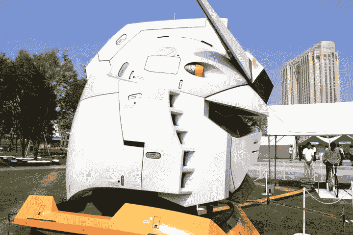
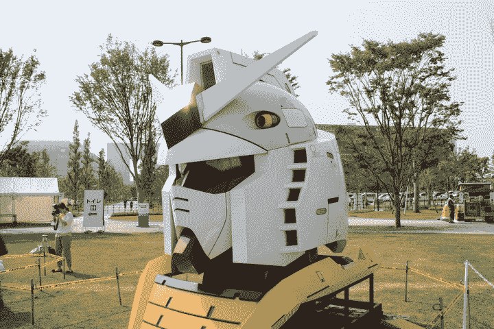
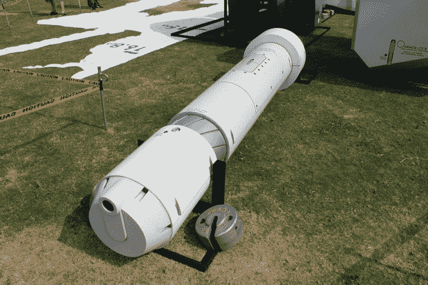
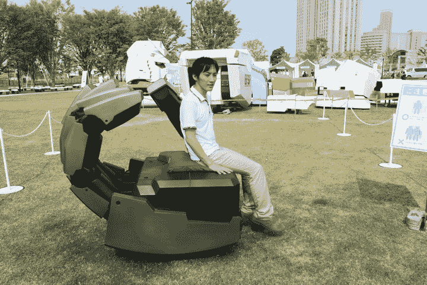

# 巨型高达机器人雕像重返东京-部分 TechCrunch

> 原文：<https://web.archive.org/web/http://techcrunch.com/2011/08/15/giant-gundam-robot-statue-returns-to-tokyo-in-parts/?utm_source=twitterfeed&utm_medium=twitter>

# 巨型高达机器人雕像回到东京——部分

在 CrunchGear times，我们已经花了[无数个帖子](https://web.archive.org/web/20230205005914/https://techcrunch.com/tag/gundam/)，来讨论 2009 年和 2010 年在东京和静冈竖立的[高达](https://web.archive.org/web/20230205005914/http://en.wikipedia.org/wiki/Gundam)的巨型(60 英尺)雕像。这座“真人大小”的雕像几个月前被拆除了，现在高达特许经营权背后的万代公司决定将它带回东京。

 

但这一次，高达没有再次竖立起来，而是部分归还。这些作品将在东京湾的人工岛台场展出到 8 月 21 日。

这里显而易见的想法是让游客(必须支付 6.5 美元)近距离观看高达的各个部分，例如头部、武器和盾牌。人们实际上可以坐在高达的手里几秒钟，或者登上固定的自行车，以产生使它的头部发光的动力(踏板动力)。

 

不错，但是“真正的”高达雕像更令人印象深刻。

Via [IT 媒体](https://web.archive.org/web/20230205005914/http://nlab.itmedia.co.jp/nl/articles/1108/13/news005.html) [JP]