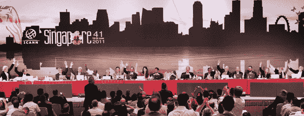

# IAB 呼吁 ICANN 撤回有争议的新顶级域名计划 TechCrunch

> 原文：<https://web.archive.org/web/https://techcrunch.com/2011/08/15/iab-calls-on-icann-to-withdraw-controversial-plan-for-new-top-level-domains/>

# IAB 呼吁 ICANN 撤回有争议的新顶级域名计划

互动广告局(IAB)今天呼吁互联网名称与数字地址分配机构(ICANN)撤回其有争议的新顶级域名计划。ICANN 的计划将显著扩大顶级域名，允许公司和品牌注册任何他们想要的词作为顶级域名(TLD)。

这意味着除了传统的顶级域名。com，。网，。org 和。比如电视，你可以有这样的域名。techcrunch，。苹果，。脸书，。酒店，。纽约。可乐，。cnn 等。

IAB 说，这些域名会给出版商和广告商带来极高的成本，而且它们还会给域名抢注者提供机会，通过“恶意”注册域名向公司勒索钱财。

“ICANN 潜在的重大变革似乎是在一个自上而下的星室中进行的。IAB 首席执行官兼总裁,[T2 说:【Randall Rothenberg】似乎没有经济影响研究，没有利益相关者充分和公开的讨论，也很少关注互联网生态系统的微妙平衡。“这对我们所代表的媒体品牌所有者和与之合作的品牌所有者来说可能是灾难性的。我们希望 ICANN 重新考虑这一考虑不周的决定以及达成这一决定的过程。”](https://web.archive.org/web/20230203191059/http://www.businesswire.com/news/home/20110815006002/en/IAB-Opposes-Web-Domain-Program-ICANN)

今年早些时候，ICANN 董事会成员投票支持新的 TLD 计划，压倒性多数支持该倡议。投票结果是 13 票对 1 票，2 票弃权。ICANN 之前还与 ICM 注册管理机构签订了合同来运营。XXX 成人网站顶级域名。

IAB 并不是唯一一个对 ICANN 的计划兴风作浪的机构。ICANN 创始主席埃丝特·戴森(以及其他人)在 7 月份 TechCrunch 的一次采访中公开反对新的顶级域名。

然而，她的论点不仅仅集中在经济影响和商标问题上，还包括对网络用户本身的影响。她说，人们的大脑空间有限。新的顶级域名将细分人们对品牌的关注。