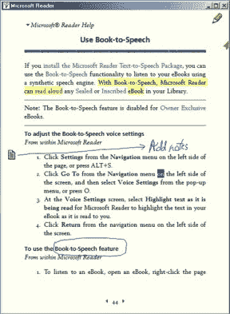

# 微软阅读器电子书系统即将结束 TechCrunch

> 原文：<https://web.archive.org/web/http://techcrunch.com/2011/08/15/microsoft-reader-e-book-system-comes-to-its-conclusion/>

# 微软阅读器电子书系统得出结论

微软正式宣布他们的 MS Reader 系统即将寿终正寝。2000 年，在 e-ink [阅读器](https://web.archive.org/web/20230205012240/https://techcrunch.com/tag/e-readers/)在一些材料研究人员眼中不仅仅是一闪而过之前，该应用程序首次推出，旨在用于 LCD 屏幕上的电子书消费，使用微软的 ClearType 字体平滑和相对紧凑、熟悉的格式。

的。lit filetype 和 Reader 应用程序只得到最轻的支持，最后一个桌面版本出现在 2007 年，最后一个移动更新使其与 Windows Mobile 6.1 同步。你不能怪他们，真的；这只不过是一种爱好(电子书那时还不是大生意)，他们也不可能预测到硬件的进步会让 Kindle 和其他流行设备成为阅读电子书的默认设备。像许多微软项目一样，它走在了时代的前面——但是太少了，太早了。

现在谁也不知道微软计划如何对待电子书。随着 Windows 8 的[新外观和感觉，微软完全有可能希望通过定制的阅读器应用程序来引入电子书支持。阅读器上市的实际时间可能是去年的任何时候，该团队可能正在利用微软的相关专利和内部进展来创建一个直播或以平板电脑为重点的电子阅读环境。](https://web.archive.org/web/20230205012240/https://techcrunch.com/2011/06/01/windows-8-brings-entirely-new-look-and-feel-unifies-touch-and-pc-interfaces/)

Reader 的开发恰逢微软第一次推出平板电脑，包括手写笔记和高亮显示等内容。Palm 和其他公司也提供了类似的功能，但是微软想得更远，可能已经为他们的下一步努力准备了一些好的资源，如果有的话。Windows 8 中吸引人的全屏应用程序和深度 Windows 集成向我表明，我们至少会看到一些原生的东西，如果不是试图取代 Kindle 和谷歌图书等专用生态系统的话。