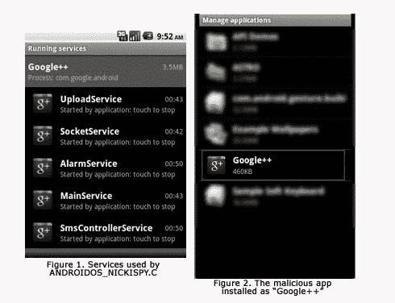
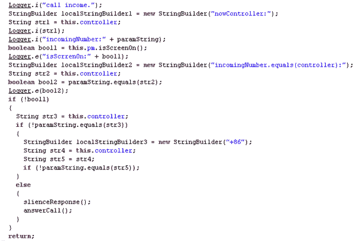
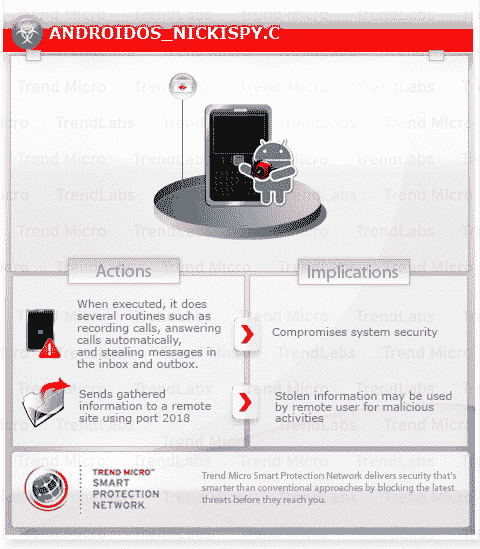

# 新的 Android 恶意软件隐藏为 Google+应用程序，为您接听电话 TechCrunch

> 原文：<https://web.archive.org/web/http://techcrunch.com/2011/08/15/new-android-malware-hides-as-google-app-answers-calls-for-you/>

趋势科技的安全研究人员在 Android 上发现了一种新的移动恶意软件应用程序，它伪装成 Google+应用程序。该应用程序能够记录电话通话，并收集手机的 GPS 位置、短信和通话记录，所有这些都被发送到远程服务器。

该应用伪装成 Google+应用程序安装在 Android 设备上，使用 Google+图标伪装在 Android 应用程序列表和运行服务列表中。

该恶意软件是之前发现的 [ANDROIDOS_NICKISPY 的变种。一个](https://web.archive.org/web/20230203103205/http://about-threats.trendmicro.com/malware.aspx?language=us&name=ANDROIDOS_NICKISPY.A)和。因为它使用的代码结构与那些应用程序中的相同。这个特殊的变体被称为 ANDROIDOS_NICISPY.C。

在这种情况下，至少，它没有出现恶意软件特别广泛，因为它没有在 Android 市场上列出。该应用似乎只安装在不知情地访问恶意网站的用户的手机上。移除就像卸载应用程序一样简单。

有趣的是，恶意软件作者是如何迅速利用对谷歌新社交网络的大肆宣传为自己谋利的。还不到两个月，Google+就已经被用作移动恶意软件的幌子。

除了记录通话和从设备收集个人数据，该恶意软件还能够通过短信接收命令，[趋势科技威胁分析师 Mark Balanza 解释道。为此，它要求发送者使用应用程序配置文件中预定义的“控制器”号来执行任何命令。](https://web.archive.org/web/20230203103205/http://blog.trendmicro.com/android-malware-eavesdrops-on-users-uses-google-as-disguise/)

但是 Balanza 说，使这种恶意软件特别独特的是它能够自动记录来电，这是其他变种所没有的。为了接听电话，手机屏幕必须关闭，电话必须来自应用程序配置文件中的某个电话号码。在接听之前，该应用程序会将手机设置为静音模式，并隐藏拨号键盘。当电话接通时，屏幕一片空白。

需要注意的是，该恶意软件的“自动应答”功能只能影响运行 Android 2.3 及以下版本的手机，因为 Android 2.3 中禁用了 MODIFY_PHONE_STATE 权限。这又是一个很好的例子，说明为什么制造商和运营商不应该阻止 Android 操作系统更新被推送到消费者的设备上。

安全公司 Lookout [本月早些时候报道称，Android 操作系统越来越成为此类恶意软件的目标。今天，Android 用户遭遇恶意软件的可能性是 6 个月前的两倍半。仅今年一年，就有 50 万到 100 万用户受到安卓恶意软件的影响。虽然这个单独的应用程序可能只是一个小威胁，但在几个月的时间里，当与所有](https://web.archive.org/web/20230203103205/https://techcrunch.com/2011/08/02/lookout-report-mobile-threat-activity-has-increased-significantly-over-past-6-months/)[其他](https://web.archive.org/web/20230203103205/https://techcrunch.com/2011/06/01/new-android-malware/)应用程序结合在一起时，恶意软件的威胁正成为 Android 用户、开发者、运营商和原始设备制造商等的担忧。