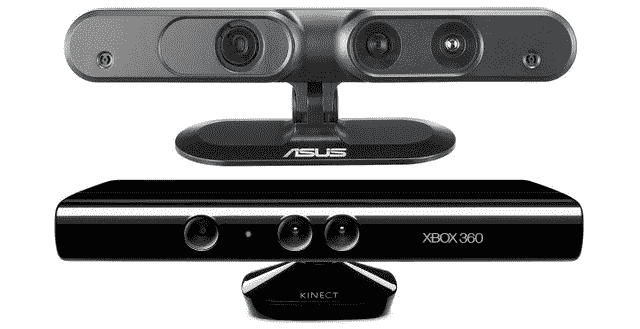

# PrimeSense 定位于与下一代电视集成 TechCrunch

> 原文：<https://web.archive.org/web/http://techcrunch.com/2011/08/15/primesense-positioning-itself-for-integration-with-next-gen-tvs/>

电视节目继续精彩上演。几年前，我们开始看到第一台联网电视，从那时起，电视制造商一直在添加越来越多稍微有用的功能，一般每一代一到两个——当然，一次推出所有功能是不行的。虽然许多功能仍然留给机顶盒、媒体播放器或控制台，但这些功能越来越强大的显示设备将不可避免地集成我们今天认为尖端的东西。

以手势控制为例。微软的热门游戏外设 [Kinect](https://web.archive.org/web/20230203045242/https://techcrunch.com/tag/kinect/) 让人们意识到了运动跟踪和深度感应摄像头的可能性，尽管[真正发挥潜力的往往是黑客](https://web.archive.org/web/20230203045242/https://techcrunch.com/2011/08/10/video-free-moving-kinect-used-to-map-room-and-objects-in-detailed-3d/)。 [PrimeSense](https://web.archive.org/web/20230203045242/http://www.crunchbase.com/company/primesense) 对 Kinect 的开发贡献良多，希望将这种下一代界面与下一代显示硬件结合起来。

PrimeSense 的 Amir Hoffnung 在 GDC Europe 上发表讲话，描述了取代传统控件的计划，并通过在不到半小时内编写一个基本游戏展示了该公司的 [OpenNI 框架](https://web.archive.org/web/20230203045242/https://techcrunch.com/2010/12/21/primesense-co-creator-of-kinect-to-lead-open-source-gesture-tech-organization/)的灵活性。他希望这个开放框架将有助于为日益强大的电视带来新的直观控制:

“您客厅中的主要产品正在不断发展。现在，客厅里有联网电视和智能电视，可以运行电视节目以外的一系列应用程序。但所有这些智能电视都需要一种新的遥控设备，因为所有这些智能电视都需要更丰富、更深层次的输入。”

他们面临着激烈的竞争:在许多非官方黑客明确表示他们手中有一个潜在的开发金矿后，微软于 6 月份开放了 Kinect SDK。尽管 PrimeSense 与华硕合作生产了一款类似 Kinect 的设备，但它要贵得多，也不尽如人意。

不过，他们不是微软给了他们一个优势。OpenNI 是开源的，当然这并不意味着它对所有人都是免费的，更有可能的是，像三星或 LG 这样的公司会尝试使用它。微软很可能已经在探索自己扩展 Kinect 的方法:不亚于盖茨本人谈论桌面计算中的应用。

霍夫农还提到了 OnLive 被搬上电视。虽然许多人仍然对这项服务持怀疑态度，但它的潜力和相关的技术成就是难以否认的。如果你将 OnLive 技术与一些基本的休闲游戏结合起来，由手势感应网络摄像头控制，它可能会爆炸。在商业广告期间，或者在等待您租借的电影缓存时，玩一会儿第三场比赛或农场模拟游戏？你最好相信有成千上万的电视迷会抓住这个机会。嗯，也许不会跳，但他们至少会挥挥手，这就够了。

不过，这都是相当遥远的猜测，这在很大程度上取决于电视制造商给他们的设备带来什么。用于视频聊天集成的高清网络摄像头，以及屏幕后面更大的马力(你需要大量的缓存和一些专门的硬件来进行硬核流和手势技术)，PrimeSense 的梦想可能会成为日常体验。