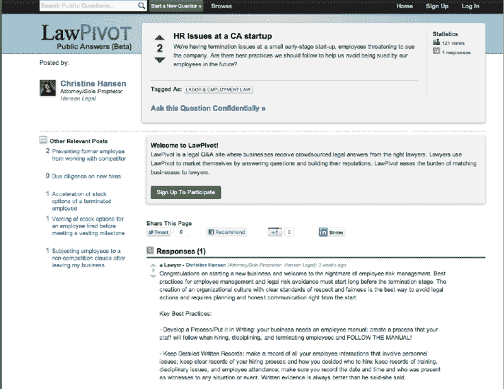

# 谷歌风投支持的 LawPivot 向公众开放法律问答平台 TechCrunch

> 原文：<https://web.archive.org/web/http://techcrunch.com/2011/08/16/google-ventures-backed-lawpivot-opens-legal-qa-platform-to-the-public/>

# 谷歌风投支持的 LawPivot 向公众开放法律问答平台

谷歌风投支持的 LawPivot 正在将一个 Q & A 平台与针对企业的法律建议结合起来，并允许科技公司和初创公司秘密地向专业律师询问法律问题。但到目前为止，LawPivot 一直保持其网站上的法律交流是保密的，因此只有律师和企业才能访问这些信息。今天，这家初创公司发布了一个面向公众的 Q &平台，允许企业公开提问，并从全国的 LawPivot 用户社区获得答案。

作为背景，LawPivot 是由一群律师和技术高管共同创立的，其中包括苹果公司首席并购律师[杰伊·曼达尔](https://web.archive.org/web/20230203140616/http://www.crunchbase.com/person/jay-mandal)；[尼廷·古普塔](https://web.archive.org/web/20230203140616/http://www.crunchbase.com/person/nitin-gupta)；知识产权诉讼律师；史蒂文·卡姆(Steven Kam)是一名软件工程师和建筑师，拥有知识产权诉讼律师的经验。

在 LawPivot 公共问答上，公司、知识产权、合同、就业、税收和移民法等专业领域的法律专家可以通过公开回答 LawPivot 社区提出的法律问题，与企业分享他们的专业知识和见解。

当然，企业仍然可以询问私人问题，但这为律师提供了一种发布法律建议的方式(或许可以获得更多业务)，并允许初创公司建立一个资源，供同行企业在寻找类似问题的答案时使用。例如，许多囊中羞涩的企业家可以利用公共产品有办法就不复杂的问题获得建议。

正如我们过去所写的，这家初创公司鼓励律师在 LawPivot 上创建全面的个人资料，公司知道他们的法律建议来自哪里。LawPivot 还会将公司与最合适的律师联系起来，回答他们的法律问题。随着公司与 LawPivot 的互动时间的推移，该网站的技术将使用用户和趋势的过去和现在的数据，为公司提供最佳律师，以根据公司的具体需求回答问题。

该公司还发布了一张信息图，详细介绍了 LawPivot 上最受欢迎的法律话题，包括一个文字可视化云，显示了企业在 LawPivot 上提出的某些话题的相对频率，描述了他们在网站上提出的问题的性质。在 LawPivot 上最受欢迎的法律问题是在公司法、知识产权、合同和互联网法律领域。

在线法律领域发展迅速，Rocket Lawyer 和 LegalZoom 等公司正在筹集大量资金。虽然 LawPivot 更侧重于一个利基社区，但该网站仍有可能扰乱商业世界的法律空间。

