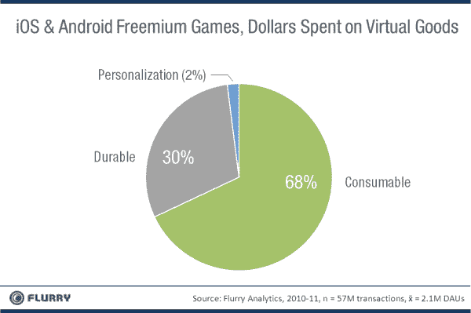

# iOS 和 Android 游戏玩家在 TechCrunch 上实际花了多少钱

> 原文：<https://web.archive.org/web/http://techcrunch.com/2011/08/16/what-ios-android-gamers-actually-spend-money-on/>

在分析了 Android 和 iOS 平台上超过 5700 万次购买的数据集后，分析公司 [Flurry](https://web.archive.org/web/20230205011944/http://www.flurry.com/index.html) [发现](https://web.archive.org/web/20230205011944/http://blog.flurry.com/bid/70096/Freemium-Mobile-Gamers-Spend-Most-Money-on-Items-They-Don-t-Keep)手机游戏玩家似乎将大部分钱花在了“可消费的”虚拟商品上。也就是说，虚拟物品在使用时会耗尽，就像战争游戏中的一组手榴弹，或者农业游戏中帮助作物生长更快的肥料。

不太受欢迎的是耐用商品(那些提供永久利益的商品)或“个性化商品”，它们纯粹是装饰升级。

Flurry 表示，应用内购买最近已经[转向](https://web.archive.org/web/20230205011944/http://blog.flurry.com/bid/70096/bid/65656/Free-to-play-Revenue-Overtakes-Premium-Revenue-in-the-App-Store)成为移动游戏的主要收入来源，现在占前 100 名免费增值游戏总收入的 65%。例如，目前 iTunes 应用商店“票房最高”类别中的前 5 名是免费游戏，25 个“票房最高”应用中有 22 个是游戏。

对于开发者来说，应用内购买是创收的主要方式。但这是一个宽泛的范畴。一个应用程序的用户可以购买升级、插件、虚拟商品、游戏内货币和其他物品来增强他们的游戏体验。

这里有趣的是，有一种应用内购买是目前最流行的:**“高级”游戏内货币**。这种货币可以用来加速游戏，或者购买非付费用户无法获得的游戏内物品。

68%的游戏玩家把钱花在“消耗品”(使用时会消耗的物品)上，而只有 30%的人购买“耐用品”。这些耐用物品可能包括角色扮演游戏中更好的盔甲，或者城市模拟中的建筑。

Flurry 指出，对一个游戏来说，提供这两种物品是很重要的，因为耐用品可以给玩家一种进步感，并允许他们通过攒钱购买大件物品来设定目标。

与此同时，只有一小部分(2%)的玩家购买个性化物品，可能是因为这些物品不会影响游戏性。Flurry 建议，除非一个游戏主要是个性化的，否则没有必要在手边保留大量这类物品。

这项研究中使用的样本大小来自一年多的数据，包括一系列免费的 iOS 和 Android 游戏的超过 5700 万次购买交易，平均每日活跃用户超过 200 万。也就是说，审查的游戏选择只是那些使用 Flurry 分析服务的游戏。