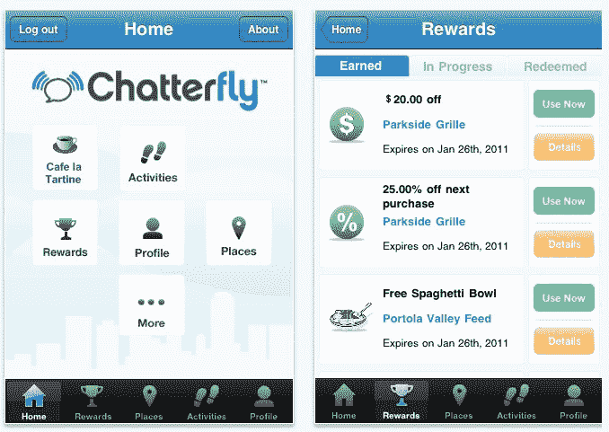

# Chatterfly 发布移动数字忠诚度应用程序 TechCrunch

> 原文：<https://web.archive.org/web/https://techcrunch.com/2011/08/17/chatterfly-launches-mobile-digital-loyalty-app/>

数字忠诚初创公司“喋喋不休”今天推出了针对企业和消费者的新奖励计划，其形式是针对苹果手机和安卓的“T2”智能手机应用程序“T3”。像类似的初创公司一样，包括现在谷歌旗下的[punch d](https://web.archive.org/web/20230205044104/https://techcrunch.com/2011/07/08/google-to-buy-mobile-loyalty-card-startup-punchd/)，Chatterfly 的目标是用一个更现代、更数字化的版本来取代纸质忠诚卡。

但是《查泰弗利》不仅仅专注于让企业的穿孔卡片移动化。这是一个完整的忠诚度系统，为企业主提供以其他方式吸引客户的机会，包括通过社交媒体网站、二维码、店内促销等。

与任何传统的忠诚度计划一样，聊天飞人的商家可以奖励在商店购物的顾客，但也可以奖励在脸书、推特、四方和谷歌+等社交网站上分享经验的顾客。

使用 Chatterfly，客户可以获得积分，这与当今流行的典型“买 10 送 1”模式不同。这些积分可以在当地企业兑换，也可以用于 Chatterfly 自身的奖励——由消费者选择。

因为它是一个移动应用程序，查特苍蝇可以利用智能手机的摄像头扫描与促销相关的特殊二维码。例如，该公司建议商店可以举办店内寻宝活动，吸引新顾客前来。或者，如果企业想做一些更简单的事情，它可以只向那些在商店里扫描二维码的人提供积分。

就其本身而言，奖励忠诚客户的想法是一个好主意，但我们认为，该应用本身需要相当多的润色。黑白照片？布局不均匀？哎呀。

当然，说服企业主实际使用这项服务仍然是一个挑战。但是 Chatterfly 有点超前了。在推出之前，该公司在旧金山湾区与 100 多家企业进行了测试，并表示收到了许多积极的回应。

该公司总部位于圣马特奥，由 Charles Michael Yim 于 2010 年 6 月创建，他之前在 Fortify Software 从事业务开发。它是私人资助的。

Chatterfly 表示，该应用程序的 iPhone 和 Android 版本现已推出，更多平台将很快推出。