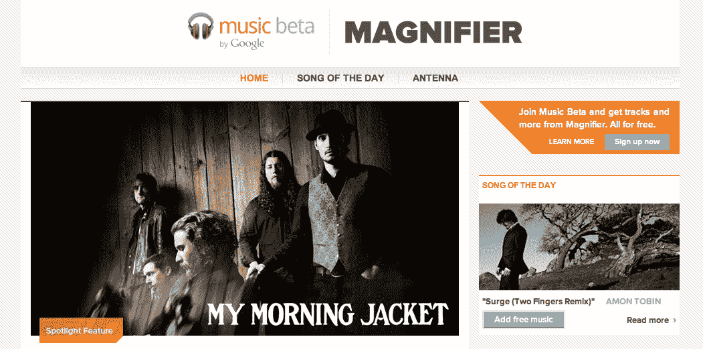

# 谷歌推出音乐博客提醒人们谷歌音乐测试版仍然存在 TechCrunch

> 原文：<https://web.archive.org/web/http://techcrunch.com/2011/08/17/google-music-magnifier/>

# 谷歌推出音乐博客，提醒人们谷歌音乐测试版仍然存在

[音乐 Beta](https://web.archive.org/web/20230203093051/http://music.google.com/) ，还记得吗？这是谷歌在 5 月的 I/O 上推出的在线音乐寄存服务。但是标题中的关键词仍然是“Beta”——也就是说，还没有为黄金时间做好准备。好吧，也许这有点不公平，这项服务确实有效——只是提供的不多。今天的一个新功能希望让人们保持兴趣，同时努力使它变得更好。

[放大镜](https://web.archive.org/web/20230203093051/http://magnifier.blogspot.com/)是一个新的音乐发现网站，谷歌[今天推出了](https://web.archive.org/web/20230203093051/http://googleblog.blogspot.com/2011/08/magnifier-taking-closer-look-at-great.html)作为对音乐测试版的补充。但我们要明确一点，这是一个博客(它甚至运行在谷歌的 Blogger 平台上)。每天，博客都会更新一首“每日歌曲”，只需点击一下就可以添加到你的音乐测试帐户中。

太好了，你不能批评免费音乐。但是放大镜仍然没有解决音乐测试版的一个核心缺陷:无法购买音乐。为了让音乐进入音乐测试版，你必须上传你自己的 MP3。现在放大镜提供了第二种方式，但还是那句话，谷歌只对少数几首歌曲获得了免费赠送的权利。据推测，他们仍在与唱片公司和版权所有者谈判，以便能够将音乐商店或流媒体服务整合到音乐产品中，但显然还没有准备好。

在它准备好之前，Music Beta 不会接近类似于“iTunes 杀手”，甚至不会是亚马逊 MP3 的竞争对手。这两项服务都提供了浏览和购买新音乐简单方法。与此同时，其他服务如 Pandora、Rdio、MOG 和刚刚在美国推出的 Spotify 从另一端用音乐流媒体进行攻击。

谷歌表示，放大镜是一种“重新点燃你对音乐的热情”的方式，但它似乎更多的是提醒人们音乐测试版的存在。对于这项服务来说，这些交易来得太快了。

