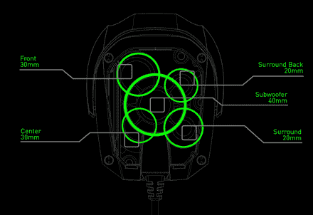

# Razer 的迪亚马特耳机使用 10 个驱动器产生 7.1 声音 TechCrunch

> 原文：<https://web.archive.org/web/http://techcrunch.com/2011/08/17/razers-tiamat-headset-uses-10-drivers-to-produce-7-1-sound/>

# 雷蛇的迪亚马特耳机使用 10 个驱动器来产生 7.1 的声音

很少有耳机有“真正的”环绕声。大多数是带有“虚拟环绕声”的传统立体声耳机——这一过程增加了深度和方向性，但通过两个扬声器传递。Tritton 和 Psyko 的耳机实际上使用多个驱动器来模拟在一个房间里，比如说，有五个扬声器通道和一个低音炮。他们的成功喜忧参半，但也许雷蛇会更幸运。他们即将推出的[迪亚马特](https://web.archive.org/web/20230203120834/http://www.razerzone.com/tiamat/en)耳机使用了不少于 10 个单独的驱动器(每个耳机 5 个)来产生他们所说的世界首创的 7.1 声音体验。

不过，当我听到它的时候，我会相信:在正确的输入下，[巨齿鲨](https://web.archive.org/web/20230203120834/https://techcrunch.com/2009/08/24/review-razer-megalodon-surround-sound-headset/)听起来很棒，但未能很好地“升级”普通立体声。希望迪亚马特处理得更好。

这款新耳机在每个听筒中都有一个前声道、后声道、侧声道和中央声道，以及一个低音炮。你可以在帅气的冰球上分别调节每个频道。当然，有一个可伸缩的麦克风。

迪亚马特 7.1 有一个小姐妹，迪亚马特 2.2，一个类似设计的虚拟环绕耳机。看起来像是[嵌合体](https://web.archive.org/web/20230203120834/https://techcrunch.com/2009/08/24/review-razer-megalodon-surround-sound-headset/)的升级版。

它们应该会在今年晚些时候发货；7.1 售价 180 美元，2.2 售价 100 美元。更多详情可在迪亚马特微型网站找到[。](https://web.archive.org/web/20230203120834/http://www.razerzone.com/tiamat/en/features)