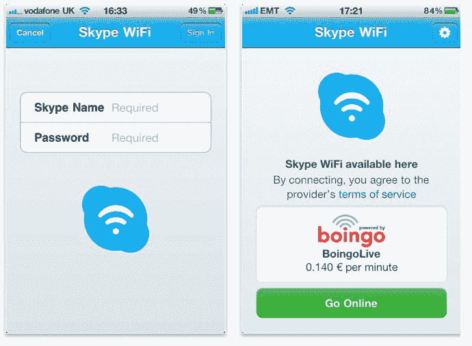

# Skype 推出新的 iOS 版 Wi-Fi Finder TechCrunch

> 原文：<https://web.archive.org/web/http://techcrunch.com/2011/08/17/skype-launches-new-wifi-finder-for-ios/>

# Skype 推出新的 iOS 版 Wi-Fi Finder

Skype 刚刚发布了一款新的 iOS 应用程序,让用户可以定位 Wi-Fi 热点，并使用 Skype 点数支付接入费用。它目前支持全球超过 100 万个热点，包括酒店、机场、火车站、会议中心、酒吧和餐馆中的热点。[解释说](https://web.archive.org/web/20230205035548/http://blogs.skype.com/en/2011/08/skype_wifi_-_now_available_on.html) Skype 说，与直接从热点服务提供商那里购买优惠券相比，使用这款应用的优势在于，你只需为实际使用的分钟数付费。

例如，按分钟付费而不是购买一段时间可以帮助旅行者省钱，因为有时你只需要一分钟的互联网接入就可以快速查看电子邮件、更新状态或发推文。有了新的应用程序，这很容易做到。

**发布会上的免费 Wi-Fi**

Skype Wi-Fi 费率从每分钟 0.06 美元/4p/€0.05 美元(含增值税)起，并且对您可以上传或下载的数据量没有限制。为了推广这款应用，Skype 将在英国夏令时 8 月 20 日(周六)00:00 至 8 月 21 日(周日)23:59 提供最长 60 分钟的免费 Wi-Fi。

新的应用程序可以在所有的 iOS 设备上运行，这意味着 iPhone，iPod Touch 和 iPad。以前，这项服务也适用于运行 Skype 软件的[笔记本电脑](https://web.archive.org/web/20230205035548/http://www.skype.com/intl/en-us/features/allfeatures/skype-access/#t_laptops)。

要使用该应用程序，只需用您的 Skype 用户名和密码登录，然后点击“在线”即可连接。

