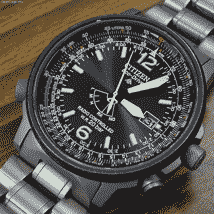
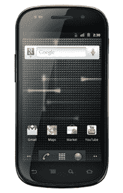

# 土地热:为什么谷歌不支持摩托罗拉成为它最喜欢的安卓系统

> 原文：<https://web.archive.org/web/https://techcrunch.com/2011/08/17/the-land-rush-why-google-wont-bless-motorola-as-its-favorite-android/>

基本情况:谷歌正在收购摩托罗拉，等待政府批准。每个人和他们的自由编辑都写了它。现在我要在演讲台上一试身手了。

我不知道谷歌为什么收购摩托罗拉，而不是简单地授权其专利。我的直觉是，这更多的是为了抵御来自微软的威胁，而不是谷歌迄今无法预见的硬件野心。

虽然我不知道*为什么是*，但我对接下来会发生什么有一些猜测。我认为一个流行的理论——谷歌将把摩托罗拉变成它选择的安卓的*之家，在它试图[模仿苹果](https://web.archive.org/web/20230320204252/http://www.slate.com/id/2301771/)的时候，比它的竞争对手拥有最新和最棒的发布——是完全错误的。*

他们说，谷歌首席执行官拉里·佩奇受到了史蒂夫·乔布斯的启发。他想完全拥有 Android 体验，从头开始控制硬件和软件。苹果通过这一策略获得了巨大的利益，谷歌也想参与其中。

从我的角度来看，前面提到的场景一点也不合理。

在我看来，Android——以及整个智能手机行业——在很大程度上仍处于一种抢占地盘的模式。未来五到十年，将有数十亿人购买智能手机。*百亿*。取目前售出的每一部安卓手机，然后乘以 10 倍。或者 30。这些手机将以前所未有的方式将计算能力和经济实惠结合起来。一部 80 美元的手机在肯尼亚卖得很火，没有合同。再过几年，他们会以零头的价格出售。

这还只是电话。谷歌在其最近的 I/O 大会上分配了大量时间来讨论 Android 的未来——一个包括 Android 驱动的扬声器、硬件配件和家用电器的未来。将会有安卓驱动的汽车控制台、冰箱、洗碗机和时钟收音机。如果它有一个 LCD 屏幕，那么它没有太多理由不能由 Android 驱动。

但是，如果谷歌希望看到这种基于 Android 的未来成为现实，时间就是关键。

 **时钟在滴答作响**

所有的智能手机平台都有很强的锁定效应。你在 iPhone 上购买的那些电影和应用程序？它们不会很快在 Android 或 Windows Phone 上运行，反之亦然。对于你的钱包来说，在这些平台之间切换是痛苦的，而且随着你不断增长的 DRMed 内容库拖累你，情况只会变得更糟。

此外还有硬件生态系统。Apple TV 已经在 iOS 上运行；谷歌电视运行在安卓系统上。Xbox 集成了 Windows Phone。这些操作系统中的每一个都将变得更加混杂，并传播到更多的设备上。今天的手机是钩子，引诱你进入 iOS 或 Android 或 Windows 的舒适环境——这些设备中的每一个都只与同一生态系统中的其他设备友好。

关键是，今天所有被 iOS、Web OS 或 Windows 抢走的客户对谷歌来说都将变得更加困难。这就是为什么它现在需要尽可能多的得到它们。

这让我们回到了摩托罗拉的交易。

**Nexus 优势？**

到目前为止，HTC、三星和其他原始设备制造商在创建一个多样化的 Android 设备生态系统方面做得非常出色，这使得谷歌的操作系统非常迅速地获得了巨大的市场份额。是的，有些设备很臭。但是你知道吗？大多数人并不真的在乎。或者说，他们不知道他们应该关心，这对谷歌来说都一样。即使是普通的安卓手机，也是对许多人正在远离的“功能手机”的巨大飞跃。

简而言之，这个系统正在做谷歌需要它做的事情。Android 像野火一样蔓延。如果说 Xoom 的过早推出证明了什么，那就是谷歌更关心在市场上获得稳固的立足点，而不是用户体验。

这就是为什么它不会利用摩托罗拉来超越现有的安卓合作伙伴。没有理由发布一套高级设备，因为 Android 并没有在挣扎。此外，谷歌即使想做也做不到:成为苹果比看起来要难。

但是你说什么？谷歌不是已经证明，当它设计硬件和软件时，它可以生产出优质的手机吗，就像它的 Nexus 系列一样？

不过，呃，Nexus 手机并不比“普通”手机好多少。Nexus One 和 Nexus S 我都广泛使用过。从硬件角度来看，它们不错，但算不上是革命性的。人们认为这些手机优越的真正原因与他们的软件有关。他们安装了“普通的”安卓系统，并且相对快速地接收系统更新。大多数人对这些事情都不感兴趣。最终，其他原始设备制造商可能能够制造出比普通 Android 更好的皮肤。

当然，谷歌仍然可以变得雄心勃勃，试图打造一个完全集成的摩托罗拉 Android 设备舰队，让所有其他设备(包括 iPhone)都相形见绌。但它只有一次机会——这样的举动会激怒它的合作伙伴，以至于他们会放弃这个平台，或者至少开始寻找替代方案。我认为谷歌不会冒这个险。

这就是为什么在可预见的未来，谷歌会尽一切努力让三星、HTC 和其他主要原始设备制造商高兴。他们将和摩托罗拉同时收到 Android 即将发布的预览。他们将被选择用于 Nexus 发布，而摩托罗拉不会。它们将有助于确保 Android 渗透到每一个市场和缝隙。

那么谷歌会给摩托罗拉带来什么变化呢，如果有的话？我的猜测是，我们将看到它开始推动 Android 的发展。摩托罗拉将开始用新的外形和全新的设备积极试水。其他原始设备制造商将很快复制这种成功，他们将享受到拓展新市场的好处。Android 将会传播得更远。

当然，如果原始设备制造商因为专利问题而担心 Android 的未来，这种土地热潮就不可能发生——这些问题可能需要数年才能解决。这就是为什么谷歌愿意砸下 125 亿美元来确保他们不再是一个问题。

 **你知道什么是酷吗？**

最后，我想解决一个争论——如果你可以称之为争论的话——这个争论最让我对 Android-land 最近的分析感到厌烦。也就是说，Android 需要立即开始赚更多的钱，以证明谷歌的巨额投资是合理的。

Google now 试图将 Android 商业化的任何尝试都类似于脸书在 2005 年左右进行的一次大规模广告推广。正如我前面所说的，这仍然是一个争夺土地的阶段。一旦谷歌拥有数十亿安卓用户，它将有大量的机会来利用他们赚钱。

他们会知道他们的用户在哪里，他们的朋友是谁，他们要去哪里——以及大量其他信息，这些信息既有点令人毛骨悚然，又非常有价值。AdWords 不会是这里的答案，但我猜谷歌将能够把这些信息转化为一些有利可图的产品。但就像脸书一样，他们可以在以后解决具体问题。在这一点上，更重要的是他们想出如何在错过机会之前将他们的用户群提高一个数量级。