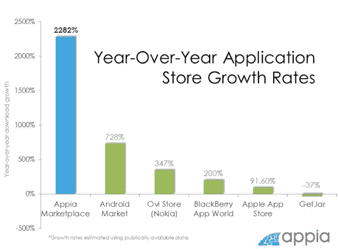

# 基于 Appia 的应用商店现在每天有 100 万次下载 TechCrunch

> 原文：<https://web.archive.org/web/http://techcrunch.com/2011/08/18/appia-powered-app-stores-now-seeing-1-million-downloads-per-day/>

# 基于 Appia 的应用商店现在每天有 100 万次下载

Appia 是一家为每个人和任何需要移动应用商店的人提供白标内容和商业平台的初创公司，它已经走过了一个重要的里程碑——该公司现在在其所有应用商店中每天有 100 万次下载(几个月前为 50 万次)。

作为背景，该公司为 40 多家合作伙伴提供移动应用商店，包括世界五大手机制造商中的四家(三星、T-Mobile、美国电话电报公司和威瑞森无线)。使用 Appia 白标产品的好处是，它使其合作伙伴能够向 3200 多个不同的移动设备品牌和型号提供应用。该公司为 T2 Opera 软件公司和墨西哥最大的运营商 Telcel 的应用商店提供支持。

仅在 7 月份，Appia 的市场下载量就超过了 4000 万次。自推出以来的 38 个月中，Appia marketplace 已经累计下载了 2 亿次，仅在过去四个月中就有超过 1 亿次下载。事实上，从 2010 年 7 月开始，Appia 的下载率达到了令人印象深刻的 2282%。Appia 的[最近推出的付费下载市场](https://web.archive.org/web/20230204233835/https://techcrunch.com/2011/04/27/white-label-app-platform-appia-launches-pay-per-download-service-for-developers/)也帮助亚马逊、Priceline 和 Cupid.com 等 30 家合作伙伴在 3 个月内提供了 250 万次赞助应用下载。

Appia Marketplace 拥有来自 32，000 多名开发人员的 140，000 个应用程序，涵盖各种主要操作系统，包括 Android、iOS、黑莓、Java、Windows 和 Symbian，每月都有数千个 Android 应用程序添加进来。在 7 月份，Appia 看到了来自 200 多个国家和 3500 种不同手机的下载。

当然，作为比较的基础，苹果的应用程序商店每月有 10 亿次应用程序下载，总下载量达到了令人印象深刻的 150 亿次。但正如你在这篇文章的图表中看到的，与其他移动应用商店相比，Appia 的应用下载量正以令人印象深刻的速度增长。由于[一个爆炸式增长的应用程序下载市场，](https://web.archive.org/web/20230204233835/https://techcrunch.com/2011/04/28/users-will-download-44-billion-mobile-apps-by-2016/)这种增长可能会持续下去。

