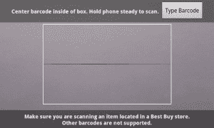
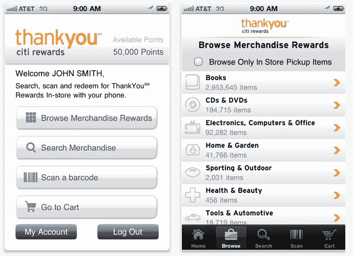

# 花旗和百思买推出移动奖励应用 TechCrunch

> 原文：<https://web.archive.org/web/http://techcrunch.com/2011/08/18/citi-and-best-buy-launch-mobile-rewards-app/>

# 花旗和百思买推出移动奖励应用

花旗和百思买联手推出了一款适用于 iPhone 和 Android 手机的移动奖励应用。“Citi ThankYou Rewards”应用程序将百思买的库存系统与花旗的“ThankYou”奖励计划联系在一起，该服务允许花旗客户通过使用花旗信用卡或进行其他银行相关活动来赢取积分。

现在，花旗客户可以使用新的移动应用程序实时跟踪他们的奖励积分，关注他们想要购买的商品，然后使用他们获得的积分支付这些商品。

这个免费应用程序是由两家公司合作开发的，一家是大型金融机构，另一家是领先的零售商。当顾客在百思买零售店购物时，他们可以扫描他们想要购买的商品的条形码。该应用程序将显示每个项目需要多少分。

当顾客准备结账时，这些商品被放在应用程序中的虚拟购物车中，以完成整个过程。一封确认电子邮件会发送到客户注册的花旗尚客优奖励电子邮件帐户，指引他们到百思买的店内提货柜台领取商品。

该应用程序还允许用户购买 Best Buy ThankYou Rewards 目录，并安排在他们选择的地点进行店内提货或将其发送到他们的家庭地址。

此外，该手机应用程序还允许花旗尚客优奖励计划会员购买奖励计划目录中未通过百思买销售的其他商品。那些物品会被直接运送到你家。

花旗忠诚度和新产品执行副总裁 Ralph Andretta 表示，在百思买之外，还有数百万种通过 ThankYou Rewards 计划进行的兑换，但花旗很高兴与这家零售商合作，它认为这家零售商是一家像自己一样的创新公司。安德烈塔表示，这款应用展示了花旗想要成为的目标:“世界上最好的数字银行。”

关于此次发布的更多细节，请参见今天上午的网络直播，现在正在[www.liveatbestbuy.com/livestream](https://web.archive.org/web/20230205023939/http://www.liveatbestbuy.com/livestream)进行。