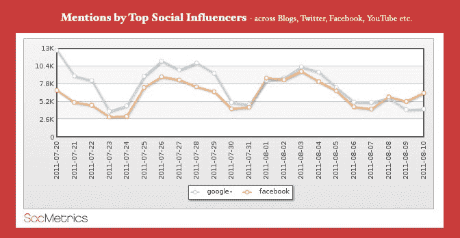
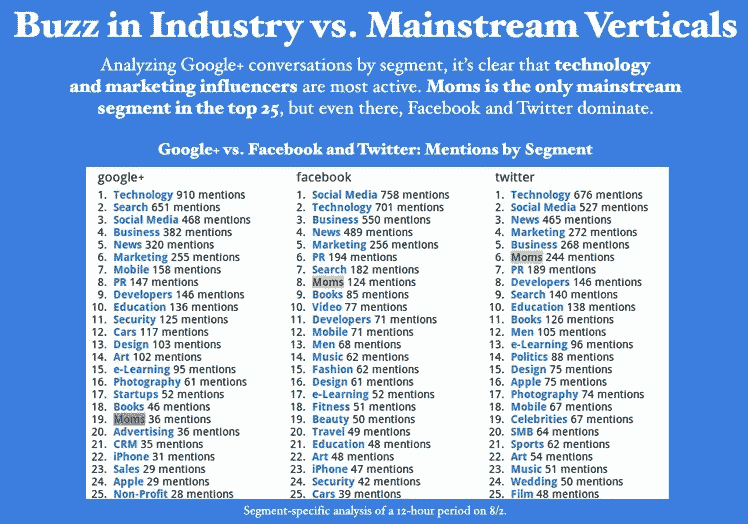
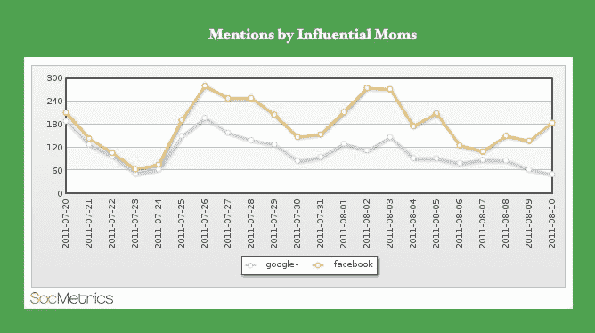
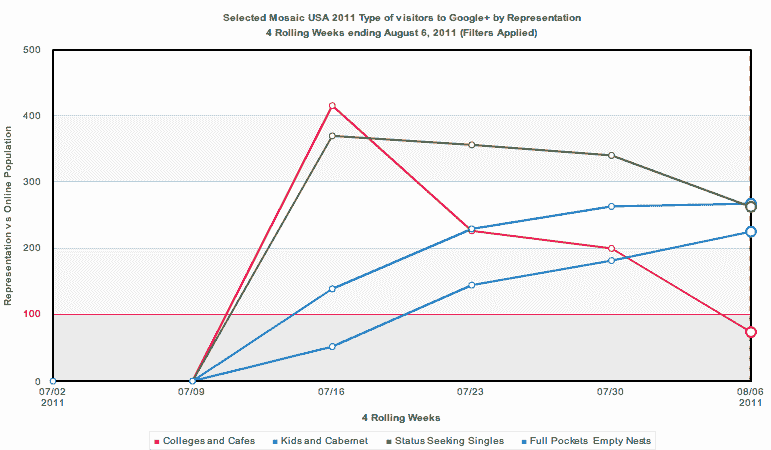

# SocMetrics 质疑 Google+的主流影响力 TechCrunch

> 原文：<https://web.archive.org/web/http://techcrunch.com/2011/08/18/socmetrics-questions-googles-mainstream-reach/>

几天前，流量分析公司 Experian Hitwise [分享了一项对超过 1000 万在线用户的研究结果](https://web.archive.org/web/20230203094937/http://weblogs.hitwise.com/bill-tancer/2011/08/google_plus_innovators_and_ear.html)，并从其发现中得出结论，谷歌的新社交网络 Google+正在进入主流领域。

社交媒体监测公司 [SocMetrics](https://web.archive.org/web/20230203094937/http://socmetrics.com/) 虽然不完全否认这些数据，但今天通过调查一个特定的垂直行业得出了略有不同的结论:*妈妈们*。SocMetrics 表示，包含“妈妈们”影响者的群体是 Google+需要重点发展的一个关键领域，尤其是考虑到这个社交网络的一个关键优势是能够通过用户创建的“圈子”(好友列表)私下或半私下发帖。

但 SocMetrics 发现，妈妈群体在 Google+上的参与度比其他群体“低得多”。

与 Hitwise 不同，SocMetrics 不关注网站访客，而是分析社交媒体提及率。这包括在博客、Twitter、脸书、YouTube 以及 Digg、Reddit 和 Disqus 上的提及。在这种情况下，该公司跟踪了从 7 月 20 日到 8 月 10 日的对话(每天 100 万次)，并进一步按纵向(行业或集团)细分。一般来说，每天有几千个关于 Google+或脸书的对话。

**母亲出现在“影响者”名单上**

在下面的图表中，SocMetrics 显示主要是行业类型(例如，技术、营销、安全、开发人员等。)谁在说 Google+。当使用这种方法进行分析时，其他更主流的垂直行业，如体育、名人和时尚，在 Google+上的代表性不足。事实上，在谈论 Google+的前 25 个细分市场中，该网络只有一个可以被视为“主流”——妈妈们。

尽管如此，这个群体在脸书和 Twitter 上的活跃程度远远高于在 Google+上的活跃程度，根据这些对话，Google+的参与度要低 30%到 50%。

你可以有几种方式来解读这个数据——要么你认为它清楚地显示了 Google+进入主流群体的艰难，要么你可能认为妈妈们*甚至*进入参与垂直市场的事实表明了社交网站的前景。

就 SocMetrics 而言，该公司认为其数据显示的曲线与 Hitwise 的早期发现相当相似。在那里，Hitwise 查看了被称为“大学和咖啡馆”、“孩子和解百纳”、“追求地位的单身人士”和“满袋空巢”的选定部分。(是的，那些显然是片段。)不管这些奇怪命名的分组，Hitwise 的数据显示了增长方面的总体持平趋势(见下文)。

【T2

SocMetrics 表示，这并不意味着 Google+最终不会成为主流，但目前它还没有走上正轨。该公司得出结论，谷歌需要迅速采取行动，利用它与妈妈们等主流群体的机会之窗，在他们的注意力进一步减弱之前。

然而，考虑到谷歌最近的招聘，看起来该公司确实意识到了它在 Google+上面临的挑战，并正在迅速采取行动应对这些挑战。