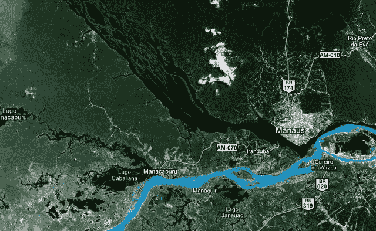

# 谷歌将街景带入亚马逊 TechCrunch 的深处

> 原文：<https://web.archive.org/web/https://techcrunch.com/2011/08/19/google-taking-street-view-to-the-depths-of-the-amazon/>

# 谷歌将街景带入亚马逊深处

很难相信谷歌街景已经使用了四年多。更令人惊奇的是，也许，考虑到他们已经搜索了世界上的街道和小巷的速度，还有任何地方没有被绘制出来。但是，尽管他们的团队已经成功地追踪了大多数大城市和许多其他有趣地区的表面，我想亚马逊的偏远地区尚未被置于镜头之下并不令人惊讶。

然而，他们的目标是改变这种状况，并在博客文章中详细介绍了[他们的计划，对河流的一大部分进行街景化。这是与在该地区工作的非营利组织](https://web.archive.org/web/20230204171910/http://googleblog.blogspot.com/2011/08/street-view-goes-to-amazon.html)[亚马逊可持续发展基金会](https://web.archive.org/web/20230204171910/http://fas-amazonas.org/)合作完成的。

然而，绘制亚马逊河及其支流的全长地图是多年的工作，所以谷歌目前还不会尝试这样做(尽管如果你好奇的话，有很多地方可以放下这个橙色家伙)。目前，他们正在集中精力研究从马瑙斯开始的 50 公里长的里奥内格罗河，就在这张照片的中心:

他们还将开着[街景三轮车](https://web.archive.org/web/20230204171910/https://techcrunch.com/2009/05/19/google-street-view-trikes-up-close/)沿着通往小村庄的土路走下去，同时绘制地图，并将架起他们用来展示商业内部的三脚架，以展现乡村生活的全景。作为慈善的临别赠言，他们将留下一些设备，可能是一些相机和笔记本电脑，供职能部门和当地人使用。整个事情是一种可持续发展的宣传，并不是说这有什么错。

没有消息说这个项目什么时候会完成——据我所知(19 世纪的游记，但仍然如此),这种旅行通常比预期的要长——但你可以在谷歌博客文章上看到更多他们工作的照片[。](https://web.archive.org/web/20230204171910/http://googleblog.blogspot.com/2011/08/street-view-goes-to-amazon.html)