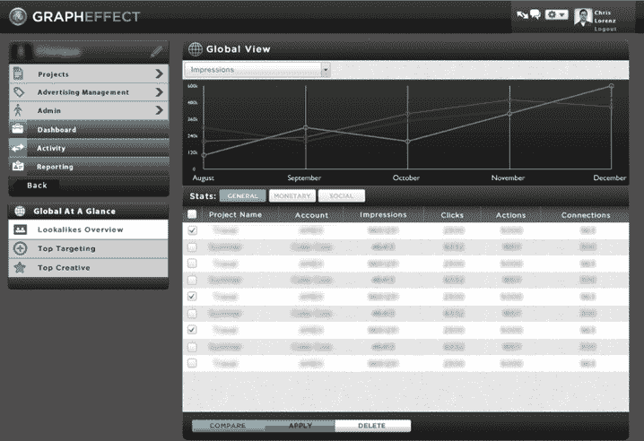

# GraphEffect 推出智能脸书广告和品牌定位平台 TechCrunch

> 原文：<https://web.archive.org/web/https://techcrunch.com/2011/08/19/grapheffect-launches-intelligent-facebook-advertising-and-targeting-platform-for-brands/>

# GraphEffect 推出智能脸书广告和品牌定位平台

脸书的广告正在爆炸式增长，预计 2011 年网络广告支出将达到 40 亿美元。很明显，品牌和公司正蜂拥至脸书来吸引用户。像 [GraphEffect](https://web.archive.org/web/20230205010251/http://www.grapheffect.com/) 这样的初创公司正试图帮助广告商在网络上投放更有针对性的广告。今天，由方正集团、Lerer Ventures 和其他公司[支持的 GraphEffect 向公众推出了它的智能定位系统。](https://web.archive.org/web/20230205010251/https://techcrunch.com/2011/02/01/grapheffect/)

GraphEffect 的平台允许广告商利用平台上没有明确表达的行为特征来定向投放脸书广告。因此，该公司挖掘业绩数据，并允许公司以一种脸书无法通过其广告平台提供的方式超目标用户。例如，基于喜好和兴趣，GraphEffect 可以识别使用虚拟货币的用户类型，并锁定这些用户。

GraphEffect us 的关键在于，它可以识别脸书用户的某些特征，包括喜欢、兴趣和人口统计数据，并创建初创公司所谓的“相似”模型。然后，品牌可以根据这些数据锁定“长相相似者”。

联合创始人詹姆斯·博罗告诉我，GraphEffect 的机制在理论上类似于 Pandora 决定在其智能音乐平台上提供类似歌曲的方式。他解释说，Pandora 不能百分之百确定你可能会喜欢某首与所选歌曲相似的歌曲，但它会提供服务，因为用户喜欢这首歌的可能性很大。GraphEffect 正在将这一模型应用于脸书和目标用户数据。

GraphEffect 平台实际上是建立在脸书的营销 API 之上的，虽然在过去一年中处于私下测试阶段，但它已经帮助了美国运通、Live Nation、通用电气、微软、倩碧等品牌，通过优化他们的媒体支出来转化购买他们的产品和服务并与之互动的用户类型。

GraphEffect 还宣布，其顾问委员会增加了四名数字媒体和广告高管。Brandon Berger、Bob Dees、Peter Hershberg 和 Dave Knox 已加入 GraphEffect 顾问委员会，并将为 GraphEffect 执行团队提供战略建议和指导。

