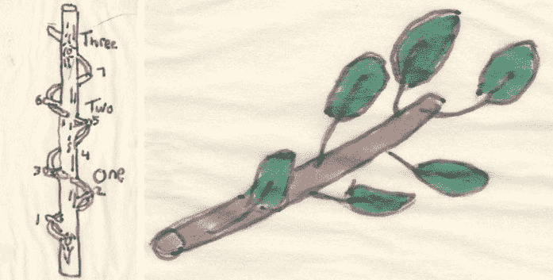
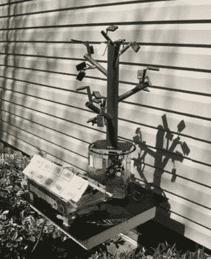

# 13 岁设计受橡树启发的高效太阳能电池阵列 TechCrunch

> 原文：<https://web.archive.org/web/http://techcrunch.com/2011/08/21/13-year-old-designs-efficient-solar-array-inspired-by-oak-trees/>

# 受橡树启发，13 岁设计高效太阳能电池板

谈到可再生能源解决方案，有时大自然有最好的想法。这是 13 岁的艾丹·德怀尔(Aidan Dwyer)在纽约卡茨基尔山(Catskill Mountains)的一次冬季远足后得出的结论，那次旅行激发他建造了一个独特而有效的太阳能电池阵列设计。

德怀尔观察了树木中的图案，经过进一步的研究和思考，意识到树枝与斐波那契数列相匹配，这是一种在自然界中发现的数学图案，如猎鹰飞行路径、鹦鹉螺壳和人体内的比例。

德怀尔推测这种模式有助于树木的光合作用，并通过建造一个微型树形太阳能电池阵列来测试他的假设。该项目为他赢得了美国自然历史博物馆颁发的 2011 年青年博物学家奖。

这位 7 年级学生在一篇[详细文章](https://web.archive.org/web/20230204223914/http://www.amnh.org/nationalcenter/youngnaturalistawards/2011/aidan.html)中描述了他的实验:

> 我设计并构建了自己的测试模型，复制了一棵橡树的斐波那契模式。我用指南针工具研究了我的结果，算出了分支角度。该模式约为 137 度，斐波那契数列为 2/5。然后我用 PVC 管做了一个模型。我用光伏太阳能电池板代替树叶，串联起来产生高达 1/2 伏的电压，所以这个模型的峰值输出是 5 伏。整个设计尽可能地复制了橡树的图案。

该设计在低日照期间比传统太阳能装置多发电 50%。单个太阳能电池板的各种角度有助于阵列捕捉光线，即使太阳在天空中非常低。此外，由于它们不是平放的，许多面板也较少受到阴影和积雪的影响。

在这一点上，Dwyer 的设计是一个后院实验，但也许在未来我们会看到种植太阳能树阵列的屋顶花园。

图片由美国自然历史博物馆提供。