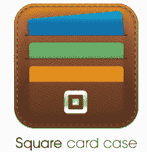

# Square 使 iOS 应用程序速度更快，不再需要 25 美元以下交易的签名 TechCrunch

> 原文：<https://web.archive.org/web/http://techcrunch.com/2011/08/22/square-makes-ios-apps-speedier-no-longer-requires-signatures-for-transactions-under-25/>

# Square 使 iOS 应用程序运行速度更快，25 美元以下的交易不再需要签名

颠覆性移动支付公司 [Square](https://web.archive.org/web/20230203044017/https://squareup.com/) 今天对其 iPhone 和 iPad 应用程序进行了大量更新，并推出了一个[重新设计和更新的网站。](https://web.archive.org/web/20230203044017/https://squareup.com/)首先，该公司表示，应用速度更快，交易速度也有所提高。该公司实际上取消了交易过程中的许多屏幕，支付可以在短短四秒钟内完成。

此外，Square 将不再要求低于 25 美元的交易需要签名。当然，这节省了收银机的时间，而且[的一些信用卡公司](https://web.archive.org/web/20230203044017/http://www.creditcards.com/credit-card-news/visa-expands-no-signature-credit-card-transactions-1273.php)已经不要求 25 美元以下的交易签名了。

该公司还向所有商家推出了最近推出的“用你的名字支付”功能，因此任何人都可以选择加入目录列表，并可以添加一个“卡套”，让他们的客户更快更方便地支付。

正如我们在 5 月份所写的，Square 首次推出了一个虚拟卡盒，消费者可以在里面填写他们访问的所有接受 Square 的商家的“卡”。这些移动卡包括位置、商家联系信息、优惠券、订单和购买历史等。更有趣的功能之一是“用你的名字付款”的能力。在箱子里的商户卡上，你可以按下“使用标签”按钮，这样常客就可以用 Square 在商户的虚拟标签上购物了。

因此，一旦你在离商户两个街区的范围内按下按钮，你就能告诉收银员你的名字，你的卡将在商户的后端 Square 收银机上收费。因为你是回头客，Square 已经有了你的付款信息。然后，当商家处理支付时，购买者将接收推送通知。

新版应用的另一个更新是新的和改进的交易小费界面，这肯定会让一些服务行业的商家高兴。商家也可以在交易中添加$0.00 的商品。这对于像额外的蛋黄酱或泡菜这样的添加物品特别有用，在这种情况下，商家希望跟踪添加了什么，但不对该物品收费。

毫无疑问，Square 正在快速成长。Square 已经售出超过 50 万个信用卡读卡器，每月处理超过 100 万笔交易。这家初创公司现在每天处理[400 万美元](https://web.archive.org/web/20230203044017/https://techcrunch.com/2011/07/31/square-now-processing-4-million-in-mobile-payments-per-day/)(每月 1 亿美元)的移动支付，首席运营官[基思·拉布瓦](https://web.archive.org/web/20230203044017/http://www.crunchbase.com/person/keith-rabois)在 7 月份告诉我们，他预计该公司到 10 月份将会把这个数量翻一番。国际扩张是 Square 下一阶段增长的一部分。