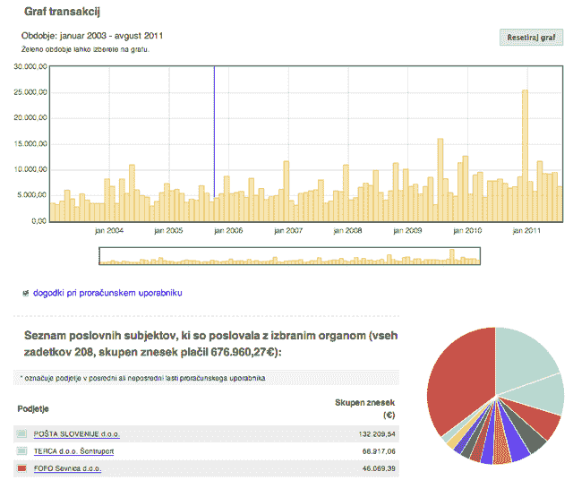

# 斯洛文尼亚推出 Supervizor，一款用于监控公共支出的官方公共网络应用

> 原文：<https://web.archive.org/web/http://techcrunch.com/2011/08/23/slovenia-launches-supervizor-an-official-public-web-app-for-monitoring-public-spending/?utm_source=feedburner&utm_medium=feed&utm_campaign=Feed:+Techcrunch+(TechCrunch>&utm_content=tweettweet&utm_campaign=tweet&utm_source=delicious_rss&utm_term=2011&utm_medium=tweet)

在政府支出等领域，腐败的威胁无时不在，在这些领域，长达数英里的繁文缛节、数十亿美元的资产以及对保密的合理需求，有时会给潜在的欺诈者带来潜在的三连击。斯洛文尼亚，在 2010 年的清廉指数中仅比表现良好的美国低几个等级，并不是毒蛇的巢穴，但是作为一个从共产主义转型的国家，他们的风险可能更大。

但是数据集更小，更易于管理——这使得对政府支出进行统一透明的监控变得更加可行。该国的预防腐败委员会刚刚推出了这样一个工具，名为 [Supervizor](https://web.archive.org/web/20230319104730/http://supervizor.kpk-rs.si/) ，如果你不介意用斯洛文尼亚语操作的话，它现在已经上线了。

正如你所看到的，信息的展示非常巧妙，而且是面向公众的:

比如说，与我最近经常浏览的美国专利局网站相比，这是一股新鲜空气——尽管严格来说，这两个网站并不属于同一个类别。

现在的数据可以追溯到 2003 年，就在斯洛文尼亚加入欧盟之前，很可能与这一特定过渡时期簿记的改善和增加相吻合。它来自财政部和公共支付管理局等公共来源，委员会谨慎地表示，它对其准确性不负任何责任。人们不禁会说，这是一种服务的奇怪附录，在这种服务中，准确性和责任至关重要，但可悲的事实是，这样的数字只取决于链条中最薄弱的一环，而在一个官僚机构(在某种程度上，所有政府都是官僚机构)中，有很多很多环节。

尽管如此，这些信息并没有隐藏在从晦涩的部委子页面链接而来的无穷无尽的等宽文本文件中。这是关于接触和透明度，这些东西在理想情况下可能会导致问责制，但不一定是它的同伴。

说这样的东西无法规模化也很有诱惑力。毫无疑问，扩展并不容易，但话说回来，如果你试图向五年或十年前的系统操作员或设计师描述现在由脸书管理的数据库，他们可能会说他们也无法扩展他们现有的数据库。我们距离能够在这种粒度级别和这种可访问性级别跟踪支出还有一段距离，但有很多项目旨在做到这一点。

[试着在主页底部输入一个搜索词](https://web.archive.org/web/20230319104730/http://supervizor.kpk-rs.si/)。我发现把他们的[政党的首字母](https://web.archive.org/web/20230319104730/http://en.wikipedia.org/wiki/Politics_of_Slovenia#Political_parties_and_elections)放上去似乎可以，但是比如“vojaki”(“military”)就不行。向将 Supervizor 组装在一起的工程师和设计师致敬；我希望我们能从其他政府和公司那里看到更多这种透明度。

**更新**:我真的应该包含一个到[USAspending.gov](https://web.archive.org/web/20230319104730/http://www.usaspending.gov/)的链接，它对联邦拨款和合同进行实质上类似的跟踪(尽管不是州或城市)。我应该承认，我不认为美国的网站会像现在这样可靠，尽管我不认为它提供了像 Supervizor 一样多的细节。我认错了，但至少这是好消息。

[via [时髦卡拉 ok](https://web.archive.org/web/20230319104730/http://www.funkykaraoke.com/2011/08/transparency.html)和[黑客新闻](https://web.archive.org/web/20230319104730/http://news.ycombinator.com/item?id=2918470)